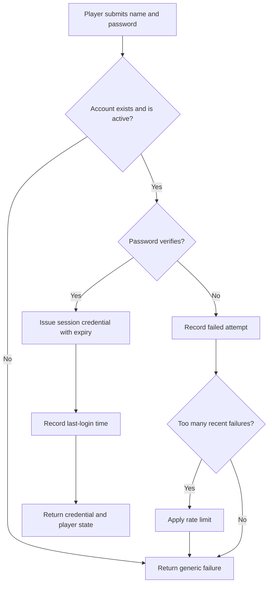
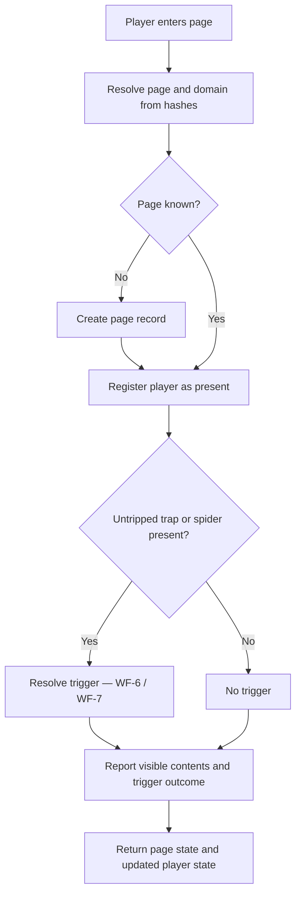
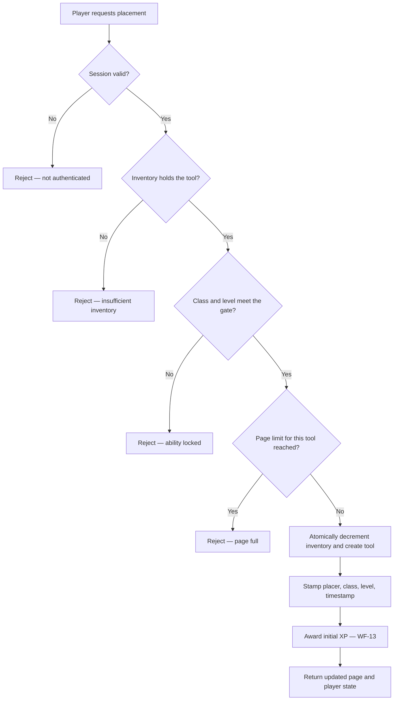
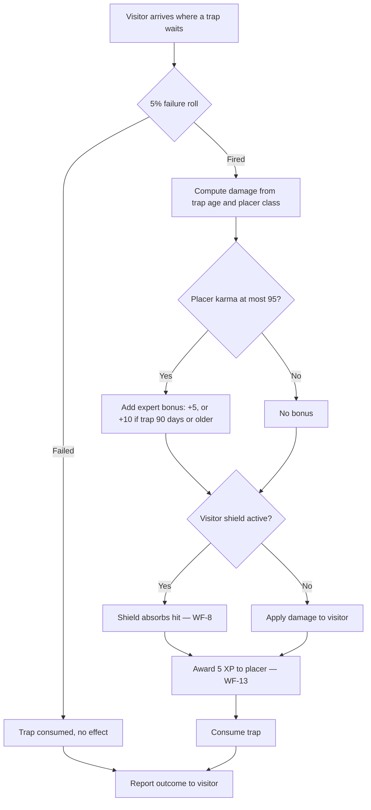
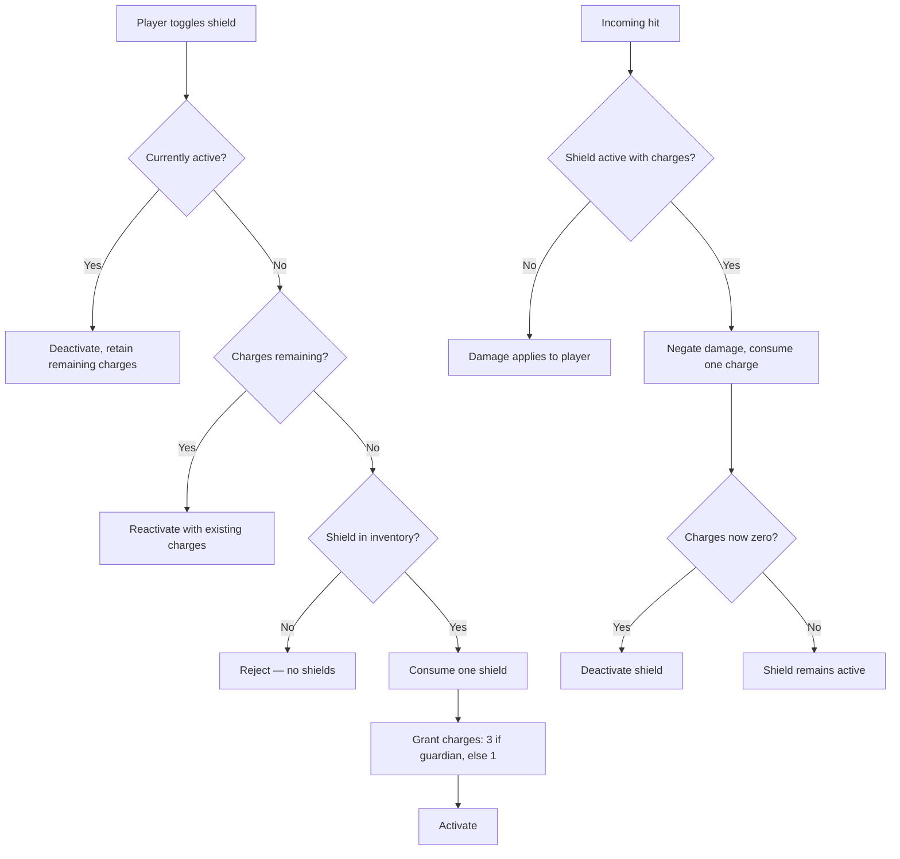
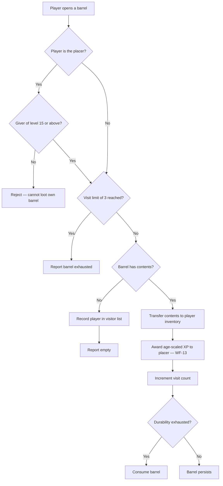
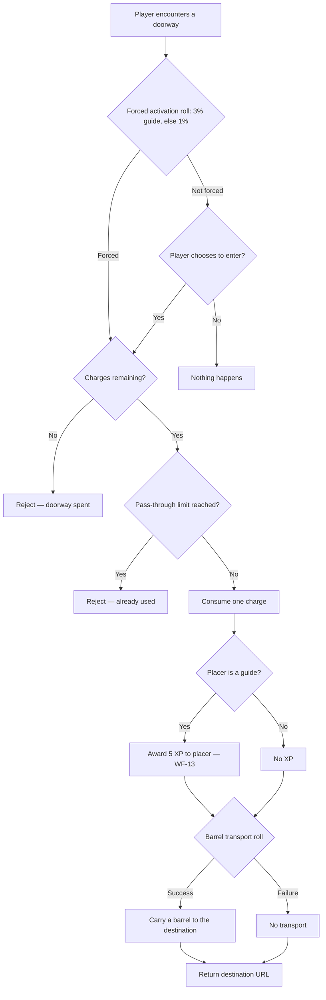

# BRD-01 — Nova Initia Server: Core Game Loop

**Status:** **Approved** by the Project Owner, 2026-08-06
**Project Owner:** Stephen Kraushaar
**Date:** 2026-08-06
**Supersedes:** nothing. First BRD of the Nova Initia server rewrite.

---

## 1. Purpose and scope

This document specifies the **core game loop** of the Nova Initia game server: how a player
comes to exist, how they acquire game objects, how they place those objects on web pages,
and what happens when another player encounters them.

**In scope:** player identity, the tool economy, page and domain state, and the complete
behaviour of all six tools.

**Out of scope, each deferred to its own BRD:**

| Deferred area | Goes to |
|---|---|
| Player-to-player mail | BRD-02 Messaging |
| Moderation of player-supplied URLs and text | BRD-03 Moderation |
| Operator administration and account management | BRD-04 Administration |
| Any client application | Not planned. See §3. |

This is a **server-only** block of work, delivered with tests. No client software is
specified, designed, or built here.

---

## 2. Context for a cold reader

Nova Initia is a massively-multiplayer game whose game board is the World Wide Web itself.
Players browse ordinary websites, and while they browse they leave game objects behind on
the pages they visit. Other players later arrive at those same pages and encounter what was
left there — a trap that damages them, a cache of supplies to loot, a portal that carries
them to a page somebody else chose.

The server's job is to remember **what is on which page**, **who owns it**, and **what
happens when somebody arrives**. It is a persistent world where the geography is the web.

A first version of this game ran on PHP until roughly 2011. A second version — a partial
Node.js rewrite — exists in this repository and does not run. Both are described in
`CODEBASE.md`. This BRD specifies a **third** implementation of the server, informed by
both but bound to neither.

### Game vocabulary

| Term | Meaning |
|---|---|
| **Tool** | Any placeable game object. There are six: trap, spider, barrel, doorway, signpost, shield. |
| **sg** | The game currency. Spent at the shop to buy tools. |
| **Class** | A player's role. Three exist: **giver**, **guardian**, **guide**. Class determines what a player is good at, what things cost them, and which abilities they unlock. |
| **Level** | A player has a separate level in each of the three classes, earned by accumulating experience in that class. |
| **XP** | Experience. Awarded for placing tools and for other players encountering them. |
| **Karma** | A player reputation score from 0 to 100. Gates certain bonuses. |
| **Page** | A single web page, as identified by the hash of its URL. The unit of game geography. |
| **Domain** | A website, as identified by the hash of its domain name. Groups pages. |
| **Placer** | The player who put a tool on a page. |
| **Visitor** | A player who arrives at a page where a tool is waiting. |
| **Trip** | To encounter and activate somebody else's tool. |

### Class specialisations, as specified by `config.js`

| Class | Tools it gets cheaply | Signature abilities |
|---|---|---|
| **giver** | traps, barrels | Anonymous traps, external barrel messages, large barrel capacity, may loot own barrels |
| **guardian** | shields | Stronger shields, wandering spiders, anti-signpost spiders |
| **guide** | doorways, signposts | Doorway chaining, multi-branch signposts, doorway use awards XP |

---

## 3. Decisions of record

These were decided by the Project Owner during requirements collection on 2026-08-06. They
are recorded here because a cold reader must be able to tell a decision from an oversight.

| # | Decision | Consequence |
|---|---|---|
| D1 | **`config.js` is the authoritative game ruleset.** | All costs, XP curves, level gates, karma thresholds, and probabilities in this document are taken from it. The test suite asserts against these values. |
| D2 | **Balance values are fixed at build time, not runtime-tunable.** | Changing balance is a code change and a deploy. The Operator actor therefore has **no runtime workflow in this BRD**. |
| D3 | **The server defines a fresh API contract.** | No compatibility with the 2011 toolbar's `/rf/remog/*` or `.php` endpoints. |
| D4 | **Registered players only.** | Every game action requires an authenticated account. There is no unregistered or anonymous participant. |
| D5 | **"Anonymous trap" is an anonymity feature, not an actor.** | A giver at level 10+ may place a trap that conceals the placer's identity from the victim. The trap still has a known owner on the server. |
| D6 | **Page identity is the hash of the URL, as in 2011.** | The client reports hashed URL and hashed domain. See RISK-2. |
| D7 | **Target is complete parity with the 2011 server design.** | All six tools, the full economy, and the XP system are in scope for this block. |
| D8 | **Delivery is one concentrated push.** | Workflows below are ordered so that an incomplete push stops at a coherent boundary. See §8. |

---

## 4. Actors

| Actor | Description | In this BRD |
|---|---|---|
| **Player** | An authenticated person with a class, levels, inventory, and karma. The only actor who performs game actions. | Primary actor of every workflow |
| **Moderator** | A player with the moderator flag, who reviews player-supplied URLs and text. | Named only. All moderator workflows are in BRD-03. |
| **Operator** | The person who runs the service and sets game balance. | Named only. Per D2 they have no runtime workflow here; balance changes are deploys. |

### Security model

The security posture of this block rests on one principle:

> **A player may only ever spend their own inventory, and may only ever act as themselves.**

Every workflow that removes something from an inventory must verify the caller owns that
inventory and that it holds enough to cover the cost. Every workflow that grants XP,
currency, or items must verify the caller is entitled to the grant.

| Right | Player | Moderator | Operator |
|---|---|---|---|
| Read own profile and inventory | Yes | Yes | Yes |
| Read another player's public profile | Yes | Yes | Yes |
| Read another player's inventory, mail, or key | No | No | Deferred to BRD-04 |
| Spend own sg / consume own tools | Yes | Yes | No |
| Spend another player's sg or tools | **Never** | **Never** | **Never** |
| Place a tool on a page | Yes | Yes | No |
| See the placer of an anonymous trap | No | Deferred to BRD-03 | Deferred to BRD-04 |
| See who is present on a page | Yes | Yes | Yes |
| Grant self XP, sg, or items | **Never** | **Never** | Deferred to BRD-04 |
| Modify balance tables at runtime | No | No | No — per D2 |

The three **Never** rows are absolute. No workflow in any BRD may introduce an exception
without amending this table first.

---

## 5. Workflows

Fourteen workflows constitute the core loop. Workflows are numbered `WF-n` and referenced
by that number elsewhere.

---

### WF-1 — Register an account

**Purpose.** Bring a new player into the world with a starting class and inventory.

**Actors.** Prospective player.

**Inputs.** Desired player name, password, email address, chosen class.

**Outputs.** A new player account with level 1 in the chosen class, starting inventory, and
starting sg. An authenticated session.

**Security rights.** Unauthenticated callers may invoke this workflow and no other. The
password must never be stored in a form from which it can be recovered. Player name must be
unique.

**Business rules.**
- A player chooses exactly one class at registration: giver, guardian, or guide.
- Starting inventory and starting sg are **OPEN-1** — `config.js` does not specify them.
- Karma begins at a starting value — **OPEN-2**, not specified.

---

### WF-2 — Authenticate

**Purpose.** Establish that a caller is a particular player, so that subsequent workflows can
charge their inventory and credit their XP.

**Actors.** Player.

**Inputs.** Player name, password.

**Outputs.** A session credential identifying the player for subsequent requests.

**Security rights.** Failure must not reveal whether the player name exists. Session
credentials must be unguessable and must expire. A credential identifies exactly one player
and grants exactly that player's rights.

**Business rules.**
- The 2011 implementation issued session keys to any caller before authentication, compared
  passwords in plaintext, and generated keys from a non-cryptographic random source. None of
  those behaviours carry forward. See `CODEBASE.md` for the original.
- Repeated failures must be rate-limited.

---

### WF-3 — Enter a page

**Purpose.** The heart of the game. A player arrives at a web page; the server reports what
is waiting there and resolves anything that triggers on arrival.

**Actors.** Player.

**Inputs.** Session credential, hashed page URL, hashed domain.

**Outputs.** The page's visible contents — barrels, doorways, signposts present — plus the
outcome of anything that triggered. Player state if it changed.

**Security rights.** A player may enter any page. A player learns only what the game intends
them to see: they must **not** learn the placer of an anonymous trap, the contents of a
barrel they have not looted, or the presence of tools that are hidden until triggered.

**Business rules.**
- Arrival registers the player as present on the page and on the domain.
- Traps and spiders resolve **on arrival**, before contents are reported. See WF-6, WF-7.
- Barrels, doorways, and signposts are reported as present and await player action.
- A page that has never been seen before is created on first arrival.

---

### WF-4 — Purchase tools from the shop

**Purpose.** Convert currency into placeable tools, at prices set by the player's class.

**Actors.** Player.

**Inputs.** Session credential, tool type, quantity.

**Outputs.** Reduced sg, increased tool count.

**Security rights.** A player may only purchase into their own inventory. Purchase must fail
atomically — a player must never lose sg without receiving tools, or receive tools without
losing sg.

**Business rules — from `config.js`.** Cost is per unit of purchase; rate is how many tools
one unit yields.

| Tool | giver cost | guardian cost | guide cost | Yield per purchase |
|---|---|---|---|---|
| Trap | 1 | 3 | 3 | 1 |
| Barrel | 1 | 3 | 3 | 1 |
| Shield | 3 | 1 | 3 | 1 |
| Doorway | 3 | 3 | 1 | 1 |
| Signpost | 3 | 3 | 1 | 1 |
| **Spider** | — | — | — | **Not purchasable** |

- Spiders have cost 0 and yield 0 in `config.js`, meaning they cannot be bought. How a player
  obtains spiders is **OPEN-3**.
- How a player earns sg is **OPEN-4** — `config.js` specifies no income source.

---

### WF-5 — Place a tool on a page

**Purpose.** The player's primary act of agency: leaving a game object on the page they are
viewing, for others to find.

**Actors.** Player.

**Inputs.** Session credential, hashed page URL, hashed domain, tool type, and any
tool-specific payload — destination URL for a doorway, comment text, NSFW flag, barrel
contents.

**Outputs.** The tool exists on the page. The player's inventory is reduced by one. The
player is awarded the tool's initial XP.

**Security rights.** A player may place only from their own inventory. Placement must fail
if inventory is insufficient, if the player's class and level do not meet the ability's gate,
or if the page has reached its limit for that tool type. Inventory decrement and tool
creation must be atomic — the 2011 code decremented inventory first and could lose the tool
on a subsequent failure.

**Business rules.**
- The placed tool records the placer, the placer's class, the placer's level at time of
  placement, and the placement timestamp. Later behaviour depends on all four.
- **Initial XP** is granted at placement: trap 5, barrel 5, spider 5, doorway 10, signpost 0.
- **Level gates** — the placer's level in the given class must meet or exceed:

| Ability | Class | Required level |
|---|---|---|
| Place an anonymous trap | giver | 10 |
| Attach an external message to a barrel | giver | 5 |
| Leave an internal message in a barrel | any | 1 |
| Place sg in a barrel | giver | 1 |
| Loot one's own barrel | giver | 15 |
| Place a wandering spider | guardian | 15 |
| Place an anti-signpost spider | guardian | 10 |

- **Page limits for doorways** — a page accepts at most 200 doorways in total; a single
  player may own at most 5 of them, except a guide, who may own up to 200.
- Barrel messages are limited to 155 characters internal, 128 external. HTML in messages is
  **not** permitted for any class.

---

### WF-6 — A trap triggers

**Purpose.** Deliver the consequence of a trap to the player who walked into it, and the
reward to the player who set it.

**Actors.** Visitor — the player who arrives. Placer — credited asynchronously.

**Inputs.** The arriving player, the trap, the current time.

**Outputs.** Damage applied to the visitor or absorbed by their shield. XP awarded to the
placer. The trap is consumed.

**Security rights.** The visitor learns they were trapped. The visitor learns the placer's
identity **only if the trap is not anonymous**. The placer is not notified in real time.

**Business rules — from `config.js`.**
- A trap has a **5% chance of failing outright** on trigger, in which case nothing happens
  and the trap is consumed. `config.js` annotates this value "Needs work."
- **Damage scales with the trap's age**, and is read from the placer's class column:

| Trap age at trigger | Damage |
|---|---|
| Under 7 days | 10 |
| 7 to 30 days | 15 |
| 30 to 90 days | 15 |
| 90 to 150 days | 25 |
| 150 days or more | 50 |

- **Expert trap bonus.** A placer whose karma is **at most 95** adds +5 damage; if the trap
  is also at least 90 days old, +10 instead. `config.js` states the benefit accrues to
  players *at most* the karma threshold, which means it rewards low karma.
- **XP to placer:** 5, at any trap age.
- If the visitor has an active shield, the shield absorbs the hit instead — see WF-8.
- An anonymous trap conceals the placer from the victim only. Ownership is retained.

---

### WF-7 — A spider triggers

**Purpose.** As WF-6, for the guardian class's offensive tool. Spiders differ from traps in
their damage curve and in two special variants.

**Actors.** Visitor, placer.

**Inputs.** The arriving player, the spider, the current time.

**Outputs.** Damage or shield absorption. XP to the placer. The spider is consumed.

**Security rights.** As WF-6. There is no anonymous variant of a spider.

**Business rules — from `config.js`.**
- **Damage is flat: 10**, regardless of age. `config.js` defines only one age bracket.
- **XP to placer scales with the spider's age** — the reverse emphasis from traps:

| Spider age at trigger | XP to placer |
|---|---|
| Under 7 days | 5 |
| 7 to 30 days | 10 |
| 30 to 90 days | 15 |
| 90 to 150 days | 25 |
| 150 days or more | 50 |

- **Wandering spiders** — a guardian at level 15+ may place a spider that relocates itself
  between pages over time. The movement rule is **OPEN-5**.
- **Anti-signpost spiders** — a guardian at level 10+ may place a spider that targets
  signposts rather than players. Its effect on a signpost is **OPEN-6**.
- `config.js` defines `crowdingSpiderPlaced` and `crowdingSpiderTripped`, both zero, with no
  comment. Their intent is **OPEN-7**.

---

### WF-8 — Equip a shield, and absorb a hit

**Purpose.** The defensive counterpart to traps and spiders. A player who anticipates danger
turns a shield on; it absorbs incoming damage until exhausted.

**Actors.** Player.

**Inputs.** Session credential; or, in the absorb case, an incoming hit from WF-6 or WF-7.

**Outputs.** Shield state toggled, or one shield charge consumed and the damage negated.

**Security rights.** A player may toggle only their own shield.

**Business rules — from `config.js`.**
- Turning a shield on with no charges remaining consumes one shield from inventory and
  grants it charges: **1 hit for a giver or guide, 3 hits for a guardian**.
- If the player has no shields in inventory, the shield cannot be turned on.
- Each absorbed hit consumes one charge. At zero charges the shield deactivates.
- Shields award **no XP** — `config.js` defines no experience curve for them.

---

### WF-9 — Stash into a barrel

**Purpose.** A player leaves supplies and a message on a page as a gift or cache for whoever
finds it next.

**Actors.** Player.

**Inputs.** Session credential, page, quantities of sg and each tool type, optional internal
message, optional external message.

**Outputs.** A barrel on the page holding the stashed contents. The stasher's inventory is
reduced by everything placed inside. Initial XP of 5, plus a fullness bonus.

**Security rights.** A player may stash only from their own inventory. All decrements — the
barrel itself plus every item placed inside — must succeed or fail together.

**Business rules — from `config.js`.**
- **Capacity:** 10 tools for a guardian or guide, **100 for a giver**. Currency counts
  against capacity at **10 sg to 1 tool slot**.
- **Placing sg** requires giver level 1.
- **Internal message** — visible on opening — requires level 1, max 155 characters.
- **External message** — visible before opening — requires **giver level 5**, max 128 chars.
- HTML is not permitted in either message for any class.
- **Fullness bonus:** 5 XP multiplied by the fraction of capacity actually filled, rounded
  down. A full barrel yields the whole 5; a half-full one yields 2.
- A barrel has a **durability** governing how many times it may be recycled, and may be
  visited at most **3 times**. The recycling probability is **OPEN-8** — `config.js` defines
  `reuseChance` as an empty list.

---

### WF-10 — Loot a barrel

**Purpose.** The reward side of WF-9. A player finds a cache and takes what is in it.

**Actors.** Visitor. Placer, credited with XP.

**Inputs.** Session credential, the barrel.

**Outputs.** Contents transferred to the visitor's inventory. XP to the placer, scaled by the
barrel's age. Visit count incremented; barrel possibly consumed.

**Security rights.** A player may not loot a barrel they placed **unless they are a giver of
level 15 or above**. A player who opens an empty barrel is recorded in its visitor list and
must not be able to loot it twice.

**Business rules — from `config.js`.**
- **XP to placer by barrel age:** under 7 days 5; 7–30 days 10; 30–90 days 10; 90–150 days
  25; 150 days or more 50.
- A barrel may be visited at most **3 times** before it is exhausted.
- Players who open a barrel while it is empty are recorded, so the same player gains nothing
  by returning.

---

### WF-11 — Traverse a doorway

**Purpose.** Doorways are the guide class's contribution to the world: a portal from the
page a player is on to a page somebody else chose. This is how players are moved around the
web by other players.

**Actors.** Visitor, placer.

**Inputs.** Session credential, the doorway.

**Outputs.** The destination URL. A charge consumed from the doorway. XP to the placer, if
the placer is a guide. Occasionally, a barrel transported to the destination.

**Security rights.** A player may traverse any doorway they can see. The destination URL is
player-supplied content — the moderation of which is BRD-03 and is **not** solved here.

**Business rules — from `config.js`.**
- **Charges:** a doorway has 50 charges, or **100 if placed by a guide of level 15+** (corrected
  by **D15**, Amendment E — `config.js` assigns the upper tier to *giver*, which the Project
  Owner has ruled a transcription error). Each traversal consumes one. At zero the doorway is
  spent.
- **Pass-through limits:** any player may traverse a given doorway **once**; the doorway's
  own placer may traverse it **3 times**.
- **XP:** only doorways placed by a **guide** award XP — 5 to the placer, regardless of the
  traversing player's class. Doorways placed by givers and guardians award none.
- **Barrel transport:** on traversal there is a chance the visitor carries a barrel through
  to the destination. The chance is `0.08 − (0.002 × player level)`, so it decreases as the
  player levels and reaches zero at level 40.
- **Forced doorways:** a doorway may activate without the player choosing it — 1% for one
  placed by a giver or guardian, **3% for one placed by a guide**.
- **Chaining** — linking doorways into a sequence — is available to **guides only**, at level
  0. Givers and guardians may never chain their own doorways. Chaining another player's
  doorway is **OPEN-9**; `config.js` leaves `chainOther` empty.

---

### WF-12 — Place and follow a signpost tour

**Purpose.** Signposts are the guide's other tool: they mark a branching trail across pages,
which other players follow as a guided tour.

**Actors.** Placer — builds the tour. Visitor — follows it.

**Inputs.** Session credential, page, destination URL, title, comment, NSFW flag.

**Outputs.** A signpost on the page. XP to the placer when followed.

**Security rights.** As WF-11, destination URLs are player-supplied; moderation is BRD-03.

**Business rules — from `config.js`.**
- **Branches** — how many onward paths a signpost may offer:

| Class | Branches by level |
|---|---|
| giver | 2, from level 0 |
| guardian | 2, from level 0 |
| **guide** | 1 at level 0; 2 at level 8; 3 at level 12; **4 at level 20** |

  A guide therefore starts weaker than the other classes and ends twice as strong.
- **Initial XP: 0.** Unlike every other tool, placing a signpost awards nothing.
- **XP on follow: 10** to the placer — the largest single award in the game.
- Anti-signpost spiders interact with signposts; the effect is **OPEN-6**.

---

### WF-13 — Award experience and level up

**Purpose.** The progression spine. Every other workflow feeds this one.

**Actors.** Player — as the recipient. Never invoked directly.

**Inputs.** Player, class the XP belongs to, amount.

**Outputs.** Increased XP in that class. Possibly a level increase, which may unlock
abilities gated in WF-5.

**Security rights.** **No player-facing entry point exists.** XP is granted only as a
consequence of WF-5, WF-6, WF-7, WF-9, WF-10, WF-11, or WF-12. This is the single most
important security boundary in the block: a callable XP grant is an unbounded exploit.

**Business rules.**
- XP accrues **per class**, not globally. A player has three independent XP pools and three
  independent levels.
- The server additionally tracks, per tool type, how many the player has **used** and how
  many have been **hit** — six pairs of counters. These are statistics, not progression.
- **The XP-to-level curve is OPEN-10.** `config.js` specifies level *gates* throughout but
  never states how much XP a level costs. **This is the single largest gap in the ruleset and
  blocks WF-13 from being implementable.** See §7.
- How karma changes is **OPEN-2**.

---

### WF-14 — Leave a page

**Purpose.** Remove a player's presence when they navigate away, so that page occupancy
reflects who is actually there.

**Actors.** Player.

**Inputs.** Session credential, page.

**Outputs.** The player is no longer listed as present on the page or, if they left the site
entirely, the domain.

**Security rights.** A player may remove only their own presence.

**Business rules.**
- Departure is best-effort: a client may close without reporting. Presence must therefore
  expire on its own, and the expiry period is **OPEN-11**.

---

## 6. Risk register

| ID | Risk | Owner decision |
|---|---|---|
| **RISK-1** | **The server cannot verify page claims.** A client asserts "I am on page X" and "I placed a trap." A modified client can forge placements, forge triggers, farm XP, and manufacture inventory. In a game whose entire economy is earned, this is the central exploit surface — and it is not fixable by validation alone, because the server has no independent way to observe where a player actually browsed. | **Recorded, unmitigated in this BRD.** No workflow above assumes the client is honest, but none can prove it dishonest either. A position must be taken before the economy is exposed to real players. |
| **RISK-2** | **Browsing history is reconstructible.** Per D6, the server stores hashed URLs. Hashes of known URLs are trivially reversed by dictionary attack, so the server in practice holds a record of where each player browsed. | **Accepted by the Project Owner** on 2026-08-06, in favour of fidelity to the 2011 design. Recorded so the acceptance is visible to anyone who later inherits the data. |
| **RISK-3** | **The XP curve does not exist.** OPEN-10 is not a detail; WF-13 cannot be built without it, and WF-5's level gates cannot be reached without WF-13. | Must be resolved before implementation. See §7. |
| **RISK-4** | **Scope against horizon.** Full parity — D7 — against one concentrated push — D8. | Flagged during interview. Mitigated by the ordering in §8, not by reducing scope. |

Two further risks are **deferred, not dropped**: player-supplied URLs reaching other players
(a malware and phishing vector, driving the whole moderator actor) moves to **BRD-03
Moderation**; browser-extension store policy blocking any future client moves to the
project-level register, since this block is client-agnostic.

---

## 7. Open questions

These are gaps in `config.js`. Per D1 it is the authoritative ruleset — so where it is
silent, there is no answer to look up, and the Project Owner must supply one. They are listed
in the order they block work.

| ID | Question | Blocks |
|---|---|---|
| **OPEN-10** | **How much XP does each level cost?** No curve exists anywhere in the repository. | **WF-13, and every level gate in WF-5.** Blocking. |
| **OPEN-4** | How does a player earn sg? No income source is specified — only spending. | WF-4. The economy has an outflow and no inflow. Blocking. |
| **OPEN-1** | What inventory and sg does a new player start with? | WF-1. Blocking. |
| **OPEN-3** | How does a player obtain spiders, given they cannot be bought? | WF-7 |
| **OPEN-2** | What is starting karma, and what raises or lowers it? Karma gates the expert-trap bonus. | WF-6 |
| **OPEN-8** | What is the probability a barrel can be recycled? `reuseChance` is an empty list. | WF-9 |
| **OPEN-5** | How does a wandering spider choose where to move, and how often? | WF-7 |
| **OPEN-6** | What does an anti-signpost spider do to a signpost? | WF-7, WF-12 |
| **OPEN-9** | May a player chain another player's doorway? `chainOther` is empty. | WF-11 |
| **OPEN-7** | What do the two zero-valued spider "crowding" settings mean? | WF-7 |
| **OPEN-11** | How long until an unreported page presence expires? | WF-14 |

Three of these — OPEN-10, OPEN-4, OPEN-1 — are **blocking**: no amount of implementation
work can proceed past them, because they define the progression and the economy that every
other workflow feeds.

---

## 8. Delivery ordering

Per D8 this is one concentrated push at full parity. If the push runs short, these are the
coherent stopping points, in order. Each leaves a server that is meaningful on its own.

1. **Identity** — WF-1, WF-2. A world with players in it.
2. **Geography** — WF-3, WF-14. Players can be somewhere.
3. **Economy** — WF-4, WF-13. Players can acquire and progress. *Requires OPEN-10, OPEN-4, OPEN-1.*
4. **First tool, end to end** — WF-5 and WF-6 for traps, plus WF-8 for shields. The full
   place-trigger-reward-defend cycle proves the architecture.
5. **Remaining offensive tools** — WF-7 spiders.
6. **Caches** — WF-9, WF-10 barrels.
7. **Guide tools** — WF-11 doorways, WF-12 signposts.

Stopping after any numbered step yields a coherent server. Stopping mid-step does not.

---

## 9. Interactions with other BRDs

Recorded now so that the documents can be reconciled while reconciliation is still a
documentation exercise.

| This BRD | Interacts with | Nature of the interaction |
|---|---|---|
| WF-6 anonymous traps | BRD-03 Moderation | A moderator investigating abuse must be able to see the placer of an anonymous trap. That right does not exist in §4 and must be added there, by amendment, when BRD-03 is written. |
| WF-5, WF-11, WF-12 | BRD-03 Moderation | Destination URLs, titles, and comments are player-supplied and reach other players. Moderation gates them; the core loop must expose a hold or review state for content awaiting it. |
| WF-9, WF-10 barrel messages | BRD-03 Moderation | Barrel internal and external messages are player-supplied text under the same constraint. |
| WF-6, WF-10, WF-11 | BRD-02 Messaging | Placers are not notified in real time when their tools are tripped. Any notification of "your trap fired" is a messaging concern, not a core-loop one. |
| WF-13 | BRD-04 Administration | Any operator ability to adjust XP, sg, or inventory is an exception to a **Never** row in §4 and requires that table to be amended first. |
| D2 balance tables | BRD-04 Administration | If runtime tuning is ever wanted, D2 is reversed and the balance table becomes managed state with its own workflows. |

---

## 10. Sign-off

This BRD is presented to the Project Owner for approval. It is **not** approved by silence.

Approval means specifically:

1. The eight **decisions of record** in §3 are your decisions, including D6 and its
   consequence RISK-2.
2. The **security model** in §4 is correct, in particular the three **Never** rows.
3. The **fourteen workflows** in §5 describe the game you intend to build.
4. The **eleven open questions** in §7 are genuinely unanswered — and you accept that
   OPEN-10, OPEN-4, and OPEN-1 block implementation until you answer them.

On approval, this document becomes the sole input to domain-model-design, which derives the
domain model and produces the Technical Requirements Document.

**Project Owner approval:** ☑ **Approved — Stephen Kraushaar, 2026-08-06**

Every assumption recorded in §3 is now a decision of the Project Owner. The eleven open
questions in §7 remain open; §7.1 below records which of them actually gate the next stage.

### 7.1 — What the blocking questions block

Recorded at sign-off, correcting the coarser claim made during the interview.

| Question | Blocks domain modelling? | Reason |
|---|---|---|
| **OPEN-4** — how is sg earned? | **Yes, partly** | An income source may introduce entities and interactions that do not otherwise exist — a shop that buys tools back, a periodic stipend, a reward tied to another workflow. This is a question about *structure*, not just about numbers. |
| **OPEN-10** — the XP-to-level curve | No | The domain needs to know that levels derive from per-class experience. What a level *costs* is a balance value, and values do not change the model. Still blocks implementation. |
| **OPEN-1** — starting inventory and sg | No | Pure values, seeded at registration. Blocks implementation only. |

Domain modelling may therefore proceed on WF-1 through WF-3 and WF-5 through WF-14. WF-4
is derivable only as far as spending; its income half waits on OPEN-4.

---

## 11. Amendment A — v1 rules recovered from the PHP server

**Raised:** 2026-08-06, after sign-off. **Status: awaiting Project Owner approval.**
**Evidence:** [PHP-ERA-FINDINGS.md](PHP-ERA-FINDINGS.md).

The v1 PHP server was located and read. Much of the game logic lived in **MySQL stored
procedures**, not in PHP — which is why `config.js` and the Node rewrite both appeared to be
missing rules that were never in either codebase. This amendment records what that recovered
evidence changes.

### A.1 — Blocking questions resolved

| Was | Now |
|---|---|
| **OPEN-10** XP curve | **Resolved.** A shared 25-row `Levels` table, one progression used by all three classes. `Experience` is the threshold to advance *from* a level. Full table in the findings document. |
| **OPEN-4** sg income | **Resolved.** Three sources: an hourly karma-weighted **stipend**, sg looted from barrels, and **50 sg each to the completer and the owner** of a finished tour. |
| **OPEN-3** spider supply | **Resolved.** Spiders are the low-karma guardian **stipend** tool, not a purchase. |
| **OPEN-5** wandering spiders | **Resolved.** `MoveSpiders_sp` relocates spiders to another page **within the same domain**, on a schedule. |
| **OPEN-1** starting state | **Partly resolved.** New players begin at level 1 — stipend 140, tools 10. Starting sg and opening inventory are still unconfirmed. |

**No blocking question remains.** Implementation is no longer gated.

### A.2 — Two workflows must be corrected

**WF-6 and WF-7 describe damage as if players had a health pool. They do not.** In v1,
**damage is a loss of sg**. A trapped player pays 15–50 sg by trap age; a spidered player pays
a flat 15 sg. This changes what those workflows do and removes any notion of player health
from the domain — `config.js`'s `baseDMG` must be read as sg, not hit points.

Both workflows must be rewritten before domain modelling consumes them.

### A.3 — Two workflows are missing entirely

Neither exists in the approved §5, and both are core loop, not deferred concerns:

- **WF-15 — Level up.** Levelling is a **purchase**, not an automatic promotion. The player
  must hold the XP threshold *and* pay the level's sg `Cost`. XP is never deducted. Cap 25.
  The v1 endpoint that performed this validated neither precondition, but the Project Owner
  confirms that endpoint was a **testing tool**, not the shipped path — so it is not evidence
  about v1's real flow. WF-15 must enforce both preconditions on the server.
- **WF-16 — Receive the periodic stipend.** An hourly grant to recently-active players of both
  sg and tools, weighted by karma. sg peaks at karma 50 and falls to a 25% floor at either
  extreme; the tool grant gives your class's **aggressive** tool below karma 50 and its
  **benevolent** tool above. This is the economic spine of the game and it is absent from
  `config.js` altogether.

### A.4 — Rules to add to existing workflows

- **WF-4** — inventory is capped per tool type at **(highest class level) × 250**.
- **WF-4** — base tool price is 1 sg, tripled outside your class's pair. This confirms
  `config.js`'s cost arrays rather than contradicting them.
- **WF-13** — karma now has consequences beyond the expert-trap bonus, so **OPEN-2** (how
  karma moves) rises from a minor gap to a central one.

### A.5 — Decision required

D1 makes `config.js` authoritative, and `config.js` is a **redesign** of v1, not a copy — the
two disagree on trap damage brackets, barrel message limits, and whether spiders can be bought.
§7 of the findings document tabulates every conflict.

D1 still resolves those conflicts in `config.js`'s favour and needs no change. But `config.js`
is **silent** on levelling, the stipend, and the inventory cap, and silence is not a decision.
The Project Owner must choose:

1. **Adopt the v1 rules** for everything `config.js` does not cover — recommended, as they are
   coherent, complete, and evidently playtested.
2. **Redesign them**, treating v1 as reference only.

**Amendment A approval:** ☑ **Approved — Stephen Kraushaar, 2026-08-06.** Option 1 adopted:
**where `config.js` is silent, the v1 rules govern.** This becomes **D9**, joining the
decisions of record in §3. WF-6 and WF-7 are to be rewritten with damage denominated in sg,
and WF-15 and WF-16 added to §5, before domain modelling begins.

### A.6 — Karma is fully specified by v1 — OPEN-2 and OPEN-13 resolved

An earlier revision of this section claimed karma was never written in v1. **That was wrong.**
The search pattern tested for `+=` and `-=`, and the code uses `++` and `--`. Karma is awarded
in `User::useTool()`, the method every tool placement runs through. Details and the full table
are in [PHP-ERA-FINDINGS.md §4a](PHP-ERA-FINDINGS.md).

Under **D9**, v1 governs, so this settles both questions:

- **Karma moves by exactly ±1 per tool use**, clamped to `[0, 100]`, with no decay.
- **Down** for traps, spiders, and doorways. **Up** for barrels, shields, and signposts —
  precisely the axis D10 records.
- **Only when the player's active class matches the tool's class.** A guide placing a trap
  moves no karma. This corroborates D11 independently.
- **An extremity bonus doubles XP**: below karma 5 an aggressive tool pays 10 XP rather than 5;
  above 95 a benevolent one does the same. Also class-gated.

Only the **starting karma value** remains unknown, and it folds into OPEN-1.

---

## 12. Amendment B — decisions closing the design gaps

**Approved by the Project Owner, 2026-08-06.** These join §3 as decisions of record.

| # | Decision | Consequence |
|---|---|---|
| **D10** | **Karma moves when a tool is used** — not on outcome, not on rating. **Traps, spiders, and doorways lower it; barrels, shields, and signposts raise it.** Confirmed against v1 (§A.6): **±1 per use, clamped to [0,100], no decay, and only when the tool's class matches the player's active class.** | Closes **OPEN-2** and **OPEN-13** outright. The karma effect belongs to **WF-5 alone** — the placement workflow — not to the trigger workflows. |
| **D11** | **Ability gates key off the active class; per-class levels persist for switching.** | A guardian does not get anonymous traps however high their giver level. Those levels are banked against a future switch rather than being dead weight. |
| **D12** | **Class switching exists and is costed.** Never built in v1; the intent was a cost of some kind. | Adds **WF-17 — Change class**. The specific cost is OPEN-12. |
| **D13** | **Tour payouts are once per player per tour.** Both the completer and the owner are still paid 50 sg, but each completer pays out only on their first completion of a given tour. | Closes the two-account farming loop without weakening the guide class's incentive. |

### B.0 — Why D10 makes the economy close on itself

The tool axis in D10 is exactly the axis the v1 stipend already branched on. Below karma 50 the
stipend grants traps, spiders, and doorways; above it, barrels, shields, and signposts. So:

> Using a tool pushes your karma toward the end that supplies **more of that same tool**, while
> the sg curve — which peaks at karma 50 — pays you **less** the further you go.

And v1's extremity bonus sharpens it further: below karma 5, or above 95, your class's
signature tool pays **double XP**.

So the poles and the middle pay in different currencies:

| | sg income | XP rate | Tool supply |
|---|---|---|---|
| **Karma 0 or 100** | 25% floor | **double** | plentiful, one tool |
| **Karma 50** | **full** | single | none in bulk |

**Levelling requires both XP and sg.** Neither pole is therefore a winning strategy on its own:
a player grinds XP at an extreme, then returns toward neutral to earn the sg that the next
level costs. That oscillation is the economic engine of the game.

Nothing in either codebase states this outright; it falls out of the stipend procedure, the
`Levels` table, and `useTool` read together. It is strong evidence the recovered v1 rules are a
coherent design rather than an accident, and the economy should be balanced with this loop in
view.

### B.1 — An interaction D11 and D12 create together

Under D10 the stipend grants your **active** class's aggressive tool below karma 50 and its
benevolent tool above. Under D12 a player may change class. Together, a player can rotate
through all three classes and harvest **all six tool types** from the stipend, which no single
class is meant to have.

**The lever is a cooldown, not a price.** An sg cost is paid once and then irrelevant to a
player with income; a cooldown long enough to span several stipend cycles is what actually
prevents rotation. OPEN-12 should therefore settle *both* a cost and a minimum interval, and
the interval is the load-bearing half.

### B.2 — Open questions after this amendment

**None block domain modelling.** All remaining items are either balance values or localised
rules.

| ID | Question | Can v1 answer it? |
|---|---|---|
| ~~**OPEN-13**~~ | ~~Karma magnitudes~~ | **Resolved** — ±1 per own-class use, `[0,100]`, no decay. See §A.6. |
| **OPEN-12** | Class-switch cost *and* cooldown interval. | No — never built. Design decision, see B.1. |
| **OPEN-1** | Starting sg and opening inventory. | Possibly — v1 registration defaults. |
| **OPEN-6** | What does an anti-signpost spider do to a signpost? | Likely — v1 has spider handling to read. |
| **OPEN-8** | Barrel recycling probability. | Likely — v1 `Gift` handling. |
| **OPEN-9** | May a player chain another player's doorway? | Likely — v1 `Doorway` chaining. |
| **OPEN-7** | Meaning of the two zero-valued spider "crowding" settings. | Possibly. |
| **OPEN-11** | Page-presence expiry period. | Possibly — v1 `Location` handling. |

Under **D9**, where v1 has an answer that answer governs, so the six marked *likely* or
*possibly* are research tasks against the PHP server rather than questions for the Project
Owner. Only **OPEN-13** and **OPEN-12** genuinely require a decision.

---

## 13. Amendment C — technical constraints

**Recorded 2026-08-06.** These bind the technical stages, not the workflows above. No workflow
in any BRD changes because of them.

| # | Decision |
|---|---|
| **D14** | **The v3 server is built on Node and PostgreSQL.** |

### C.1 — What D14 obliges the TRD to settle

v1 kept a meaningful share of its game logic in **MySQL stored procedures** — the stipend
(WF-16), level purchase (WF-15), and wandering-spider movement all live there, not in
application code. D14 does not say where that logic goes in v3, and there is a real choice:

1. **Port them to PostgreSQL functions**, keeping the logic in the database and scheduling it
   there. Closest to v1, and keeps the periodic grants atomic against the data they touch.
2. **Move them into Node**, leaving PostgreSQL as storage. Easier to test and version, but the
   stipend becomes a scheduled application job with the concurrency and idempotency questions
   that implies — v1's `StipendLog` exists precisely because a double-run pays players twice.

This is a **TRD decision**, not a BRD one, and it is flagged here only so it is not discovered
late. WF-15 and WF-16 are written to be indifferent to the answer.

### C.2 — Consequence for the existing JSON test store

`lib/jsonstore.js` and `test/fixtures/` present a **Mongoose-shaped** interface, because they
exist to exercise the abandoned v2 Node code, which is MongoDB-shaped. Under D14 the v3 server
is neither.

That work remains valid for what it was built for — running and testing the legacy v2 code
without a database — but it is **not a foundation for the v3 server** and should not be
mistaken for one. The v3 data layer starts fresh against PostgreSQL. The fixture *data* is
still useful as seed material, since it encodes `config.js`-consistent players and placements.

---

## 14. Amendment D — parity additions to the core loop

**Recorded 2026-08-06** under the parity split approved by the Project Owner. These are the four
gaps from [PARITY-REVIEW.md](PARITY-REVIEW.md) assigned to BRD-01; the other four went to
BRD-05 and BRD-06.

### D.1 — WF-18 — Dismiss a placement

**Purpose.** Let a player hide a doorway or barrel they have already dealt with, so revisiting
the page stops re-offering it.

**Actors.** Player.

**Inputs.** Session credential, the placement.

**Outputs.** That placement is suppressed for that player only.

**Security rights.** A player may dismiss only for themselves. Dismissal must never remove the
placement, alter another player's view, or affect its rating.

**Business rules.**
- Dismissal is recorded per player per placement. v1 keeps exactly this — a per-player record
  against each doorway and each barrel, carrying both the interaction and the dismissal.
- **That same record is what makes rating possible** (BRD-06 WF-06-1) and what enforces
  doorway pass-through limits (WF-11). It is one record serving three purposes, and WF-3 and
  WF-11 must create it whether or not the player ever dismisses anything.
- Dismissing a tour is BRD-05 WF-05-6.

**This closes a real hole in WF-3.** As approved, WF-3 reports every barrel and doorway on a
page on every visit, forever. Dismissal is what makes revisiting a page tolerable.

### D.2 — WF-3 addendum: page identity is a first-class record

v1 keeps a dedicated registry mapping a URL hash and a domain hash to a stable page identity,
and everything else — placements, presence, spider movement — references that identity rather
than the hashes. `MoveSpiders_sp` depends on it to find other pages in the same domain.

WF-3 must therefore **resolve or create the page identity first**, and the rest of the loop
works from the identity. This is already implied by WF-3's "create page record" step; it is
recorded explicitly because the domain model needs page identity as an entity in its own
right, not as a pair of hashes carried around.

### D.3 — NSFW filtering is a request-scoped server-side filter

Both v1 and the toolbar treat this as a **per-request flag the client asserts**, not a stored
user preference: the client sends a filter header, and the server appends an NSFW exclusion to
the queries behind WF-3, WF-11, and WF-12.

**Filtering is the server's job.** A client that omits the header sees everything, so this is a
display preference and not a safety control — it protects a willing player, not an unwilling
one. Genuine suppression of harmful content is BRD-03.

Consequence for WF-3: page contents are filtered before they are reported, so two players on
the same page may legitimately see different things.

### D.4 — WF-11 addendum: doorway chains, and OPEN-9

A doorway chain uses **the same container type as a tour** — the structure documented in
PARITY-REVIEW §"What `Group` actually is". A chain is a container whose members are doorways
linked one-to-the-next; a tour is a container whose members are signposts forming a tree.

v1 details:
- A doorway records which chain it belongs to, and its position via a next and a parent link.
- The client declares which chain it is currently following via a request header, and the
  server returns the next doorway in that chain for the current page.
- Chain listings are NSFW-filtered per D.3.
- A doorway may start a chain when it belongs to no chain, or when it is the chain root and has
  no children yet.

**OPEN-9 remains open.** `config.js` permits chaining one's own doorways to guides only, and
leaves chaining another player's doorways unspecified. The v1 check governs chain *structure*
and does not test ownership, so it neither confirms nor denies the permission. Under D9, v1
would govern if it had an answer, and it does not clearly have one. This stays a decision for
the Project Owner and is **not** blocking — WF-11 is complete without it.

---

## 15. Amendment E — corrections and a recovered rule

**Approved by the Project Owner, 2026-08-06.**

| # | Decision |
|---|---|
| **D15** | **Doorway charge tiers belong to the *guide*, not the giver.** A doorway carries 50 charges, rising to **100 when placed by a guide of level 15 or above**. Givers and guardians remain at 50. |
| **D16** | **A player may place at most 250 of a given tool type on any single page.** Recovered from v1. |
| **D17** | **A placement behaves according to the placer's class and level at the moment it was placed**, and is unaffected by the placer's later levelling or class change. |

### E.1 — Why D15 overrides D1

`config.js` assigns the upper charge tier to `giver`. That is the **only** rule in its doorway
block that does not favour the guide — cost, experience, chaining, forced activation, and page
limits all do:

| Doorway rule | Favours |
|---|---|
| `cost: [3,3,3,1]` | guide |
| `experience` | guide — only guide-placed doorways award XP |
| `chainOwn` | guide — `Infinity` for the others |
| `forceDoorway` | guide — 3% against 1% |
| `pageLimits.own` | guide — 200 against 5 |
| `charges` **as written** | **giver** |

Doorways are the guide's signature tool by every other measure. The Project Owner has ruled the
`giver` key a transcription error, most likely from the block being drafted by copying the
first class key. v1 offers no tiebreak: it decrements a doorway's charge count and retires the
doorway at zero, but where that count is initialised was not located.

**D1 still stands generally** — `config.js` remains authoritative. D15 is a correction to a
specific entry the Project Owner has identified as a mistake, not a change of policy.

### E.2 — D16, the per-page placement cap

v1 refuses a placement when the placing player already has 250 of that tool type on that page,
counted by a dedicated stored procedure. It appears in neither `config.js` nor the approved
WF-5.

**This is a different rule from the inventory cap in Amendment A.4**, and the two are easily
confused because they share the number 250:

| | Limits | Scope |
|---|---|---|
| **A.4 inventory cap** | how many you may **hold** | per tool type, `max class level × 250` |
| **D16 placement cap** | how many you may **put on one page** | per tool type, per page, per player, flat 250 |

WF-5 gains a corresponding rejection: placement fails when the cap is reached, alongside the
existing inventory, level-gate, and page-limit checks.

### E.3 — D17, and why it is stated explicitly

A placement's later behaviour depends on the placer's class and level: WF-6 reads the damage
column for the placer's class, and WF-11 reads the charge tier for their class and level under
D15. Since players level up (WF-15) and may change class (D12), those values must be **captured
at placement** rather than read live.

Without it, a giver who levels and switches to guardian would retroactively change the damage
of every trap they ever set, and those traps would be scored against the wrong class column
entirely.

Both prior implementations already do this — v1 stores the level on every placement row, and
v2 carries class and level on all five placement models — so D17 records existing behaviour
rather than introducing it. It is written down because it is invisible in code: reading the
placer's current level instead works perfectly until the first player levels up.

---

## 16. Amendment F — URL normalisation: what makes two pages the same place

**Approved by the Project Owner, 2026-08-06.**
**Evidence:** [PHP-ERA-FINDINGS §6d](PHP-ERA-FINDINGS.md).

| # | Decision |
|---|---|
| **D18** | **URL normalisation is a specified, versioned domain rule, not a client implementation detail.** Every placement records the normalisation version under which its page identity was computed. |
| **D19** | Normalisation folds the scheme, the `www.` host prefix, host case, default ports, a single trailing slash, and a denylist of tracking parameters; it sorts surviving query parameters and preserves path case. |

### F.1 — Why this is a business decision, not a technical one

The board is made of pages. What counts as *the same page* decides where two players can meet,
and meeting is the entire game. v1 left this rule in a regex inside the browser extension,
unspecified anywhere else — so the geography of the game was an accident of client code.

v1's rule fragmented the board badly. Query strings were retained, so every `utm_source`,
`fbclid`, and session id minted a fresh empty square; a trap on a canonical article was never
found by anyone arriving from a shared link, which is how most people arrive.

### F.2 — The normalisation algorithm

Applied in order. Any step may be revised, which is what D18's version tag is for.

1. **Reject** anything that is not `http` or `https`.
2. **Fold the scheme** — `http` and `https` produce the same identity.
3. **Lower-case the host.** Hostnames are case-insensitive by specification. v1 disabled
   lower-casing entirely, which was correct for paths and wrong for hosts.
4. **Strip the `www.` prefix** from the host. Applied to **both** the page identity and the
   domain identity, so `www.example.com` and `example.com` are one place *and* one domain.
   Implemented as a configurable prefix list so further prefixes can be added under a new
   version; `www` is the only entry at version 1.
5. **Drop a default port** — `:80` for http, `:443` for https.
6. **Preserve path case.** Paths genuinely are case-sensitive on many servers.
7. **Fold a single trailing slash**, so `/page` and `/page/` are one place. A bare host
   normalises to `/`.
8. **Remove query parameters on the tracking denylist** (F.3). Keep all others — some genuinely
   identify distinct pages, which is why wholesale removal is rejected.
9. **Sort the surviving query parameters by name.** `?a=1&b=2` and `?b=2&a=1` are the same page
   and must hash alike. v1 missed this.
10. **Drop the `?` entirely** if no parameters survive.
11. **Discard the fragment** `#…` — as v1.
12. **Hash** the result, and separately hash the normalised host as the domain identity.

### F.3 — The tracking parameter denylist

Removed by exact name or by prefix. Version 1:

| Source | Parameters |
|---|---|
| Analytics | `utm_*`, `_ga`, `_gl`, `yclid`, `_openstat` |
| Google Ads | `gclid`, `dclid`, `gbraid`, `wbraid`, `gclsrc` |
| Social | `fbclid`, `twclid`, `igshid`, `ttclid`, `li_fat_id` |
| Microsoft | `msclkid` |
| Email | `mc_cid`, `mc_eid`, `vero_id`, `vero_conv` |
| HubSpot | `_hsenc`, `_hsmi`, `hsa_*` |
| Adobe | `s_kwcid`, `ef_id` |
| Marketplaces | `spm`, `scm` |

**Deliberately excluded from the denylist**, despite often being tracking: `ref`, `source`,
`cid`, `id`, `s`, `q`, `page`, `v`. Each is load-bearing on real sites — `?v=` identifies a
YouTube video, `?q=` a search, `?page=` a pagination position. Stripping them would merge
genuinely different pages, which is a worse failure than leaving a few duplicates: merging
puts players in the wrong place, while fragmenting merely keeps them apart.

The denylist is **reference data**, revisable under a new normalisation version without
touching the algorithm.

### F.4 — Where normalisation runs, and the tension in that

Under **D6** the client hashes the URL and the server never sees the raw address. So in practice
**normalisation executes on the client**, and D18 makes the server the owner of the
*specification*, not of the execution.

That tension is real and should be stated rather than glossed:

- If the **client** normalises, the server cannot verify it was done correctly. A modified
  client can present any identity it likes — which is **RISK-1**, already accepted and already
  unmitigated. Normalisation adds no new exposure here; it inherits the existing one.
- If the **server** normalised, it would need the raw URL — which is strictly worse for privacy
  than **RISK-2**, since the server would hold browsing history in plaintext rather than as
  reversible hashes.

D6 therefore settles it: the client executes, the server specifies, and the version tag is what
makes a future correction tractable.

### F.5 — WF-3 addendum

WF-3 resolves page identity from the hashes the client supplies. It additionally records the
**normalisation version** those hashes were computed under, and stores it with any placement
created on that page.

A client presenting an unknown or retired normalisation version must be refused rather than
silently accepted, because its hashes address a different board.

### F.6 — OPEN-14: Text Fragments and sub-page addressing

**Undecided. Raised by the Project Owner 2026-08-06, deliberately left open.**

Step 11 discards the fragment, which means D19 currently strips **both** of these, treating each
as the same place as the bare page:

| Form | Example | Origin |
|---|---|---|
| **Named anchor** | `…/article#section-3` | Author-defined, finite, stable |
| **Text Fragment** | `…/article#:~:text=some%20phrase` | **User-generated, unbounded, arbitrary** |

Text Fragments did not exist when v1 was built, so v1's silence is not guidance.

**They are not really a normalisation question. They are a question about the resolution of the
board** — whether a "place" is a page, or something finer. Three positions:

1. **Strip them, as D19 does now.** A text fragment is the same place as its page. Simple and
   consistent with every other fragment.
2. **Treat them as distinct places.** *Not recommended.* Anyone can craft any text fragment for
   any page, so the board would shatter into unboundedly many squares that no second player
   would ever independently land on — the tracking-parameter problem in a far worse form. It
   would also hand any client a way to mint infinite fresh, empty geography.
3. **Use them as a sub-page coordinate**, where the page remains the unit of the board but a
   tool may additionally be pinned to a passage within it. A trap on a paragraph rather than an
   article. This is a **new mechanic**, not a normalisation rule, and would need its own BRD.

**Named anchors are a separate and more tractable question**, and should not be decided by the
same answer. They are author-defined and finite, so `#section-3` on a long article is a
plausible distinct place in a way that an arbitrary text fragment is not. Distinguishing them
would deepen the board without shattering it.

Two practical notes for whoever takes this up:

- **Fragments are never transmitted in an HTTP request.** The server can only learn of one if
  the client explicitly reports it, so this is entirely a client-and-specification question.
- **The browser strips everything after `#:~:` before the page sees it**, so a client reading
  `location.hash` will not see a text fragment; it must read the full address bar.

**Recommendation for now: keep stripping both** — which is what D19 already does, so no change
is required to proceed. Revisit as a deliberate feature decision rather than as a
normalisation tweak.

### F.7 — The v1 board does not survive this, and would not have anyway

Every one of v1's 24,193 placements was hashed from an `http://` URL under v1's rules. The
modern web is `https://`, so those placements already sit at coordinates no current browser
generates. **The historical board was unreachable before this amendment and is unreachable
after it.**

This is recorded so that the loss is understood as pre-existing rather than caused by D19, and
so no future reader attempts a migration that cannot work.

---

## 17. Amendment G — chaining, and class switching removed

**Approved by the Project Owner, 2026-08-06.**

| # | Decision |
|---|---|
| **D20** | **A player may chain onto another player's doorway.** Resolves **OPEN-9**. Chaotic by design. |
| **D21** | **Class switching is out of scope.** A player's class is chosen at registration and does not change. Supersedes **D12**; **OPEN-12** is moot. |

### G.1 — D20, and how it combines with the existing rule

`config.js` and D20 govern two different acts, and they land in different places:

| Act | Permitted to | Source |
|---|---|---|
| Chain onto **your own** doorway | **guides only**, from level 0 | `config.js` `chainOwn` — giver and guardian are `Infinity`, i.e. never |
| Chain onto **another player's** doorway | **any player, any class** | **D20** |

The asymmetry is deliberate and is where the chaos comes from. A giver or guardian can never
author a chain of their own, but may freely extend somebody else's. Chains therefore tend to
grow collaboratively and unpredictably rather than being authored end to end, while a guide
retains the ability to build a deliberate sequence.

**If a broader reading was intended** — for example that chaining is unrestricted in both
directions — say so and D20 will be widened. As recorded, `config.js` still governs the
own-doorway case under D1.

### G.2 — What open chaining implies

Recorded now so these are not discovered as surprises:

- **Chains have no single author.** A chain's container carries an owner, but its members may be
  placed by anyone. Traversal XP still goes to **each doorway's own placer** (WF-11), not to the
  chain's owner, so open chaining creates no reward-farming path.
- **A chain can be extended maliciously.** Appending a doorway to a popular chain is a way to
  route traffic somewhere harmful, and it reaches whoever was already following the chain. This
  belongs on **BRD-03 Moderation**'s register, and it is a stronger case than incidental
  placement because it inherits an existing audience.
- **Chains can cycle.** They are a linked list, and D20 lets anyone append, so a doorway may
  eventually point back into the chain. Traversal must tolerate this — signpost tours already
  carry visited-tracking (BRD-05 §3) and doorway traversal needs the same protection.

### G.3 — D21, and what removing class switching changes

**WF-17 is withdrawn.** `config.js` never specified switching, v1 never implemented it, and it
was only ever an intention.

Three consequences:

1. **A design risk disappears.** Amendment B §B.1 identified that switching combined with the
   karma-driven tool stipend would let a player rotate classes and harvest all six tool types,
   which no single class is meant to hold. Without switching there is nothing to rotate. **B.1
   is void**, and with it the requirement for a cooldown.
2. **OPEN-12 is moot** — there is no switch cost or interval to decide.
3. **D11 stands, but for a different reason.** D11 keyed ability gates to the active class while
   per-class levels persisted "for switching." The gating half is unchanged. The persistence
   half survives on its own merits: XP accrues to a class **by action type regardless of the
   player's own class** — a guardian who trips traps still gains giver XP — so all three
   progress records fill up whatever happens.

   v1 behaved exactly this way: XP accumulated in all three classes, but only the **active**
   class could be levelled up. The other two pools sit inert. That is now the specified
   behaviour, and if switching is ever revisited those banked pools are what make it
   meaningful.

---

## 18. Amendment H — starting state

**Approved by the Project Owner, 2026-08-06. Resolves OPEN-1.**

| # | Decision |
|---|---|
| **D22** | A new player starts with **20 sg**, **karma 50** (neutral), **level 1 in all three classes**, **zero XP**, and an inventory of **10 of each tool of their own class and 5 of every other tool**. |

### H.1 — Starting inventory in full

Each class owns two tools (TRD §2.1). A new player therefore holds **40 tools** — 20 in-class,
20 out-of-class:

| Tool | Giver starts with | Guardian starts with | Guide starts with |
|---|---:|---:|---:|
| Trap | **10** | 5 | 5 |
| Barrel | **10** | 5 | 5 |
| Spider | 5 | **10** | 5 |
| Shield | 5 | **10** | 5 |
| Doorway | 5 | 5 | **10** |
| Signpost | 5 | 5 | **10** |

**Correction to an earlier draft of this section.** It claimed a non-guardian who spent their
five spiders would have no further supply. That was wrong: **barrels are containers of tools**
(WF-9, WF-10), so a guardian may stash spiders and any player who loots that barrel gains them.

Barrels are the game's **player-to-player transfer mechanism**, and they are what keep every
tool reachable by every class. Spiders cannot be bought and are granted by the stipend only to
guardians below karma 50 — so for a giver or guide, the starting five plus **whatever they loot
from barrels** is the entire supply. That makes guardians the source of spiders for the rest of
the world, which is a genuine economic dependency between classes rather than a gap.

### H.2 — Why neutral karma is the right start, and what it costs the player

Karma 50 is the **peak of the stipend curve** (PHP-ERA-FINDINGS §2). A new player therefore
begins on maximum sg income — and simultaneously on **zero bulk tool supply and single XP**,
because the tool grant only pays out away from the midpoint and the extremity bonus only pays at
the poles.

So the economic engine engages from the first hour. The starting position is the one that pays
best in currency and worst in everything else, and every subsequent choice of tool moves the
player off it. Nothing needs to teach this; playing does.

### H.3 — Whether 20 sg is enough to begin

Sanity checks against the recovered tables:

- **Tools:** 1 sg in-class, 3 out-of-class. 20 sg buys 20 more of your own tools, so the opening
  position is roughly 60 in-class tools' worth of capability.
- **Levelling:** advancing from level 1 costs **120 sg** and **630 XP**. Neither is reachable at
  the start, which is correct — the first level should be earned.
- **Income:** the level-1 stipend is 140 sg per cycle at karma 50, so currency stops being the
  constraint quickly. **XP is the real gate on the first level**, and 40 starting tools yield
  roughly 200–400 XP if all are placed. A new player must therefore keep playing to reach
  level 2, which is the intended shape.

The starting grant bootstraps a player into the loop without shortcutting the first level.

---

## 19. Amendment I — balance becomes tunable data

**Approved by the Project Owner, 2026-08-06. Amends D2.**

| # | Decision |
|---|---|
| **D23** | **Balance scalars are database reference data**, adjustable by an operator without a code change or deploy. Every change is audited. The **formulas** that consume them remain in code. |

### I.1 — Why D2 is amended

D2 fixed all balance at build time. The Project Owner reports that in v1 *"we were constantly
adjusting sg awards — a balance thing"*, which makes every tuning change a code edit plus a
deploy under D2. That is friction against the activity the game actually required.

It also did not match v1, which already worked this way in part: the `Levels` table — stipend,
cost, tool allowance — and the `Tools` table's base cost were **ordinary database rows an
operator could `UPDATE`**. v1's balance was already split between SQL data and PHP formulas.
D23 makes that split deliberate and complete rather than accidental and partial.

### I.2 — The dividing line

**Formulas stay in code. Scalars become data.**

| Stays in code | Becomes data |
|---|---|
| The stipend's karma curve — a triangle peaking at neutral, with a floor | The peak karma value, the floor fraction, the per-level stipend |
| The ×N multiplier applied to out-of-class tool purchases | The multiplier, and each tool's base cost |
| Bracket *lookup* — "find the band this age falls in" | The bands themselves and their values |
| Clamping karma to its bounds | The bounds, and the size of the step |
| Whether an ability is gated on class and level | Which class, and which level |

The test is whether a change alters **behaviour** or only **magnitude**. Magnitudes are data.

### I.3 — Consequences

- **Tuning becomes an `UPDATE` plus a reload**, not a deploy.
- **Every change is audited** — who, when, from what, to what — by the same trigger mechanism
  used elsewhere. This is not optional: without it the ledger becomes uninterpretable, because
  a historical entry reading *"stipend +140 sg"* is meaningless once the stipend value has
  changed. The audit log is what lets any past entry be read against the values in force at the
  time.
- **Operators gain a genuine runtime capability**, which they did not have under D2. The
  Operator actor in §4 acquires its first real workflow. The security table's
  *"Modify balance tables at runtime — No"* row is superseded for the Operator only; **Player
  and Moderator remain barred**, and the three **Never** rows are untouched.
- Balance values are still **not** player-visible. Nothing here exposes them through a player
  API.

### I.4 — What this does not change

`config.js` remains the **source of the initial values** under D1, and the migration that seeds
the balance tables is where those values enter the system. D1 governs what the numbers *are* at
the outset; D23 governs where they *live* and who may change them afterwards.
