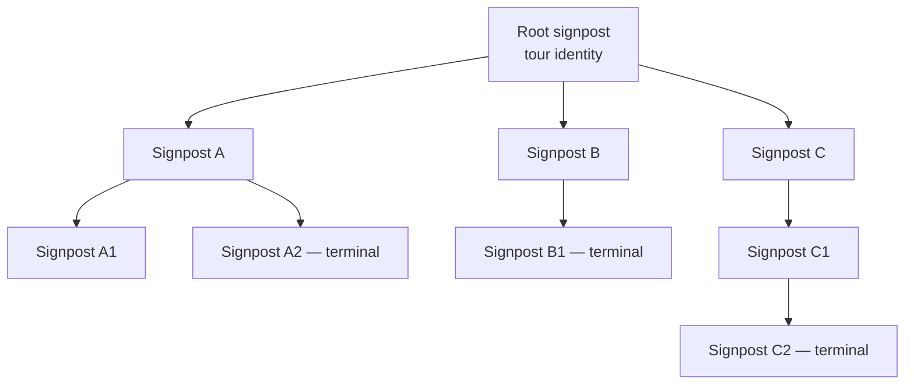
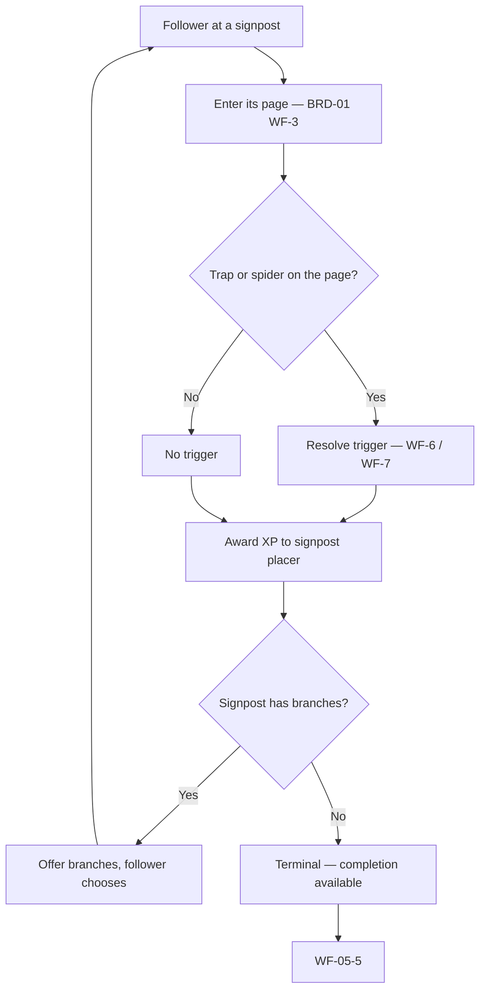
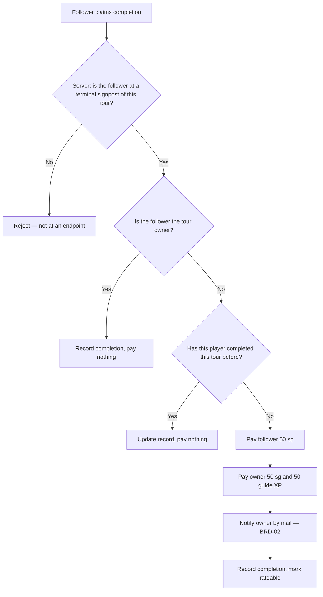

# BRD-05 — Tours

**Status:** **Approved** by the Project Owner, 2026-08-06
**Project Owner:** Stephen Kraushaar
**Date:** 2026-08-06
**Depends on:** [BRD-01](BRD-01-core-game-loop.md) core game loop, decisions D1–D13
**Evidence:** [PARITY-REVIEW.md](PARITY-REVIEW.md), [PHP-ERA-FINDINGS.md](PHP-ERA-FINDINGS.md)

---

## 1. Purpose and scope

A **tour** is a trail of signposts across web pages that one player builds and others follow.
It is the guide class's reason to exist, and the largest feature in v1 that BRD-01 does not
cover — BRD-01's WF-12 describes placing a single signpost, while v1 has an entire subsystem
for building, publishing, finding, following, completing, and retiring tours.

**In scope:** tour construction, the signpost tree, tour discovery, following, completion and
its payout, dismissal, and retirement.

**Out of scope:** doorway chains (structurally different, see §3); rating mechanics, which are
shared with doorways and belong to BRD-06; moderation of tour titles, descriptions, and
destination URLs, which is BRD-03.

---

## 2. Context for a cold reader

In v1 the tour subsystem was called `Group`, a name that hid what it does. Read
[PARITY-REVIEW.md](PARITY-REVIEW.md) §"What `Group` actually is" before this document.

The short version: a **tour** is a named, owned, rateable collection whose members are
signposts. Its identity is the identity of its **root signpost** — the group and its root
placement share one ID. Signposts join a tour by referencing it.

---

## 3. A tour is a tree, not a list

This is the single most important structural fact in this document, and BRD-01 gets it wrong.

Each signpost carries **four** onward pointers. A tour is therefore a **tree**: a follower
arriving at a signpost may be offered up to four ways onward, and choosing one is a real
choice, not a step along a fixed path.

**Doorway chains are a different shape** — a linked list, one successor per doorway. The two
must not be merged in the domain model even though v1 gave them a shared container.

**How many branches a signpost may offer** is set by the placing player's class and level, from
`config.js`:

| Class | Branches |
|---|---|
| giver | 2, from level 0 |
| guardian | 2, from level 0 |
| **guide** | 1 at level 0; 2 at level 8; 3 at level 12; **4 at level 20** |

A guide begins weaker than the other classes and ends twice as strong. This matches v1's four
branch columns exactly.

**Terminal signposts** are those with no first branch. v1 identifies the end of a tour by the
absence of an onward pointer, and completion is only awarded at a terminal signpost.

**Cycles are possible and must be tolerated.** v1's tree walk carries a list of already-visited
signposts and refuses to revisit — so a tour that loops back on itself is a supported state,
not an error to reject at build time.

---

## 4. Actors

| Actor | Role in this BRD |
|---|---|
| **Tour owner** | A player who builds and maintains a tour. Any class may build one; only guides get more than 2 branches. |
| **Follower** | A player who discovers and walks a tour. Any player. |
| **Moderator** | Named only. Tour titles, descriptions, images, and destinations are player-supplied — all moderation is BRD-03. |

### Security rights

| Right | Owner | Follower | Moderator |
|---|---|---|---|
| Add or remove signposts in a tour | Yes, own only | No | BRD-03 |
| Edit tour title, description, image | Yes, own only | No | BRD-03 |
| Retire a tour | Yes, own only | No | BRD-03 |
| Follow a tour | Yes | Yes | Yes |
| Earn the completion payout | **No — see WF-05-5** | Yes | Yes |
| Dismiss a tour from their own view | Yes | Yes | Yes |
| See who has completed a tour | Aggregate only | No | BRD-03 |

---

## 5. Workflows

### WF-05-1 — Build a tour

**Purpose.** Create a named trail and establish its root.

**Inputs.** Session credential, title, description, optional image, the root signpost.

**Outputs.** A tour owned by the caller, identified by its root signpost, initially enabled.

**Security.** A player may create tours only under their own ownership. Title, description, and
image are player-supplied and subject to BRD-03.

**Business rules.**
- Creating a tour consumes a signpost from inventory and follows BRD-01 WF-5 for placement,
  including its karma effect — signposts raise karma.
- The tour's identity is its root signpost's identity.
- A new tour starts **enabled** with no rating and no votes.

---

### WF-05-2 — Extend a tour

**Purpose.** Add a signpost as a branch of one already in the tour.

**Inputs.** Session credential, parent signpost, branch slot, page, destination, title, comment,
NSFW flag.

**Outputs.** A new signpost joined to the tour, occupying one branch slot of its parent.

**Security.** Only the tour's owner may extend it. The branch slot must be within the owner's
class-and-level allowance (§3). Placement consumes inventory per BRD-01 WF-5.

**Business rules.**
- A parent signpost may hold at most 4 branches, and at most as many as its placer's class and
  level allow.
- Attaching to an occupied slot must be refused rather than silently replacing.
- A signpost with no branches is terminal and marks a completable end of the tour.
- A tour may contain cycles; the follow workflow tolerates them.

---

### WF-05-3 — Discover tours

**Purpose.** Let players find tours to follow, rather than only stumbling into signposts.

**Inputs.** Session credential; a search term, or a request for one's own tours.

**Outputs.** Matching tours with title, description, image, owner, rating, and vote count.

**Security.** Any player may search. **Retired tours must not appear** (§WF-05-8). Tours the
player has dismissed must not appear. Results carry NSFW flags so a client honouring the
player's filter preference can act on them.

**Business rules.**
- Searchable by title and description text.
- "My tours" returns tours the caller owns, retired ones included.
- v1 additionally listed the signposts belonging to a given player; that is BRD-06 discovery.

---

### WF-05-4 — Follow a tour

**Purpose.** Walk the tree. The follower arrives at a signpost, sees where it can lead, and
chooses a branch.

**Inputs.** Session credential, current signpost, chosen branch.

**Outputs.** The destination of the chosen branch, and the branches available from the signpost
reached.

**Security.** Any player may follow any enabled tour. A follower must not be shown branches
that do not exist, nor the tour's completion state for other players.

**Business rules.**
- Arriving at a signpost's page is an ordinary page entry and runs BRD-01 WF-3 in full —
  **traps and spiders on that page trigger normally.** A tour route can be mined.
- Following awards the tour owner XP per BRD-01 WF-12.
- Revisiting an already-visited signpost within one traversal is permitted; the client is
  responsible for not looping the player indefinitely.
- Reaching a terminal signpost makes WF-05-5 available.

---

### WF-05-5 — Complete a tour

**Purpose.** Reward a follower for finishing, and the owner for having built something worth
finishing.

**Inputs.** Session credential, tour, the page the follower is on.

**Outputs.** On a player's **first** completion: **50 sg to the follower**, and **50 sg plus
50 XP in the guide class to the owner**, who is notified by mail. A completion record either
way.

**Security.** This is the largest single payout in the game and the most attractive exploit
surface in this BRD. Three rules are mandatory:

1. **The server must verify the follower is actually at a terminal signpost of that tour.**
   v1 checked that the player's last recorded page matched both the URL hash and the domain
   hash of a terminal signpost in the tour. A completion claim must never be taken on trust.
2. **Payout is once per player per tour.** Repeat completions are recorded but pay nothing.
   This is v1 behaviour, not a new restriction — see §6.
3. **An owner completing their own tour must not be paid.** v1 does not appear to check this,
   and it is the obvious self-deal.

**Business rules.**
- Completion state per player per tour records the date, that it was taken, whether it has
  been dismissed, and whether it has been rated.
- The owner's payout accrues **once per distinct completer**, and is uncapped across players —
  a popular tour earns its owner indefinitely. That is intended.
- A completed tour becomes rateable — BRD-06.

---

### WF-05-6 — Dismiss a tour

**Purpose.** Let a player hide a tour they have finished with, so discovery and in-page prompts
stop offering it.

**Inputs.** Session credential, tour.

**Outputs.** The tour is suppressed for that player only.

**Security.** A player may dismiss only for themselves. Dismissal must never affect another
player's view or the tour's rating.

**Business rules.**
- Dismissal is per player per tour and is reversible only by the player.
- A dismissed tour still counts as completed, and its payout is not reversed.

---

### WF-05-7 — Rate a tour

Specified in **BRD-06**. Recorded here because the completion record carries the "has rated"
state and because tour rating is **separate from doorway rating** — the two must not be merged.

---

### WF-05-8 — Retire a tour

**Purpose.** Let an owner take a tour out of circulation without destroying it.

**Inputs.** Session credential, tour.

**Outputs.** The tour stops appearing in discovery and stops accepting completions. Its
signposts remain placed.

**Security.** Owner only.

**Business rules.**
- Retirement is reversible.
- **The signposts are not removed** — a player already walking the tour still encounters them
  as ordinary signposts. Retirement affects discovery and completion, not the game board.
- A retired tour must not pay completions.
- Whether a retired tour's existing ratings persist is **OPEN-05-1**.

---

## 6. Corrections to earlier documents

Both of these were found while drafting and should be applied.

**D13 was already v1 behaviour, not a change.** BRD-01 Amendment B records D13 — tour payouts
once per player per tour — as a fix for an uncapped farming loop. v1 already guarded this: the
payout runs only when no completion record exists for that player and tour. The empty
`GroupComplete` table is why the guard was not visible from the data. **D13 is faithful to v1**,
and the "two accounts could farm it indefinitely" concern was mistaken as applied to a single
tour. The owner's per-distinct-completer earning is uncapped and intended.

**The tour owner also receives 50 XP in the guide class** on each first completion. BRD-01 does
not record this, and it is the guide class's largest XP award by a wide margin — placing a
signpost pays 10.

---

## 7. Open questions

| ID | Question |
|---|---|
| **OPEN-05-1** | Do a retired tour's ratings and completion records survive retirement and reinstatement? |
| **OPEN-05-2** | May a player build a tour from signposts placed by others, or only their own? v1's ownership model implies own only, but the branch pointers do not enforce it. |
| **OPEN-05-3** | What is `Signpost.System` in v1? A flag for system-generated signposts, and unexamined. |
| ~~**OPEN-05-4**~~ | ~~May a signpost belong to more than one tour?~~ **Resolved 2026-08-06: no — a signpost belongs to one tour at a time.** Membership is therefore a single reference on the signpost, not a many-to-many relation. "At a time" implies a signpost may be *moved* between tours, so the reference is mutable; what is forbidden is simultaneous membership. |
| **OPEN-05-5** | Is there a maximum tour size, in signposts or depth? v1 sets none, so a tour can grow without bound. |

---

## 8. Interactions with other BRDs

| This BRD | Interacts with | Nature |
|---|---|---|
| WF-05-1, WF-05-2 | BRD-01 WF-5 | Placing a tour signpost is an ordinary placement — inventory, level gates, and the karma rise all apply. |
| WF-05-4 | BRD-01 WF-3, WF-6, WF-7 | Tour pages are ordinary pages. A tour can be routed through mined pages, deliberately. |
| WF-05-5 | BRD-01 WF-13 | The 50 XP owner award is a WF-13 grant and must not have a player-facing entry point. |
| WF-05-5 | BRD-02 Messaging | Owners are notified by in-game mail on completion. |
| WF-05-7 | BRD-06 | Tour rating lives there, and is a separate system from doorway rating. |
| WF-05-1, WF-05-3 | BRD-03 Moderation | Titles, descriptions, images, and destinations are player-supplied and reach other players through a **discovery surface**, which amplifies reach beyond incidental encounter. |

---

## 9. Sign-off

**Project Owner approval:** ☑ **Approved — Stephen Kraushaar, 2026-08-06**

Approval confirms that a tour is a **tree** and not a path, that completion is server-verified
and paid once per player, and that the two corrections in §6 are accepted — D13 was already v1
behaviour, and the tour owner also receives 50 guide XP per first completion.

The five open questions in §7 remain open. None blocks schema work; OPEN-05-4 (may a signpost
belong to more than one tour) is the only one with a schema consequence, and is answered
conservatively as **no** until decided — one tour per signpost, which is what v1's schema
permitted.
