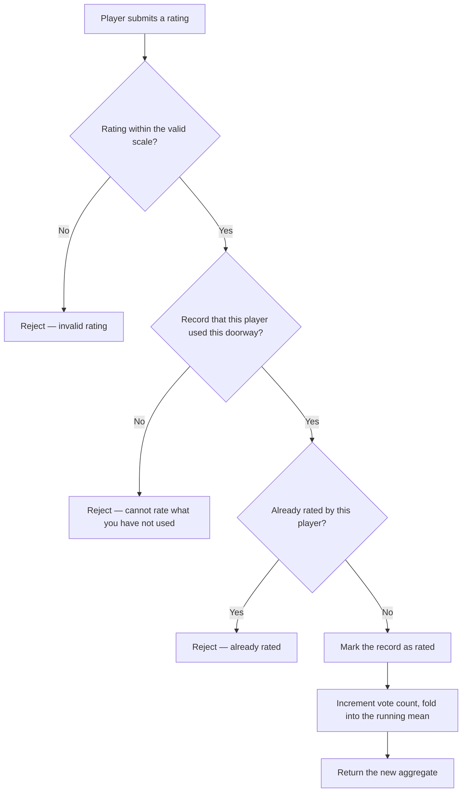

# BRD-06 — Reputation and Discovery

**Status:** **Approved** by the Project Owner, 2026-08-06
**Project Owner:** Stephen Kraushaar
**Date:** 2026-08-06
**Depends on:** [BRD-01](BRD-01-core-game-loop.md) core game loop, [BRD-05](BRD-05-tours.md) tours
**Evidence:** [PARITY-REVIEW.md](PARITY-REVIEW.md), [PHP-ERA-FINDINGS.md](PHP-ERA-FINDINGS.md)

---

## 1. Purpose and scope

Two capabilities that BRD-01 leaves out and that v1 shipped:

- **Reputation** — players rate the doorways they walk through and the tours they finish, so
  that quality becomes visible before a player commits to a destination.
- **Discovery** — players browse and search what exists, rather than only encountering things
  by walking into them.

They belong in one document because discovery is what makes reputation worth having, and
because both raise the same risk: they **amplify reach**. A doorway encountered incidentally
reaches whoever wandered onto that page; a doorway surfaced by search reaches whoever went
looking. Player-supplied destinations behave differently once they can be found on purpose.

**In scope:** rating doorways, rating tours, the discovery and search surfaces, player profiles
and avatars.

**Out of scope:** acting on what ratings reveal — hiding, removing, or penalising badly-rated
content is **BRD-03 Moderation**. This BRD produces the signal; BRD-03 consumes it.

---

## 2. Two rating systems, deliberately separate

v1 has two, and they must not be collapsed into one.

| | Doorway rating | Tour rating |
|---|---|---|
| Subject | A single doorway | A whole tour |
| Who may rate | Any player who has used that doorway | Any player who has **completed** that tour |
| Eligibility record | Per player per doorway | Per player per tour, on the completion record |
| Held on | The doorway | The tour |

A doorway rates one destination. A tour rates a curated experience of many. Merging them would
make a tour's score a function of its members' scores, which is not what either measures.

---

## 3. Actors

| Actor | Role |
|---|---|
| **Player** | Rates what they have used, and browses what exists. |
| **Content owner** | The player who placed a doorway or built a tour, and receives its reputation. |
| **Moderator** | Named only. Consumes ratings as a signal; all action is BRD-03. |

### Security rights

| Right | Player | Owner | Moderator |
|---|---|---|---|
| Rate a doorway they used | Yes, **once** | Yes, if they used it | Yes |
| Rate a doorway they never used | **Never** | **Never** | **Never** |
| Rate a tour they completed | Yes, **once** | See OPEN-06-2 | Yes |
| Change a rating already given | No — see OPEN-06-1 | No | BRD-03 |
| See an aggregate rating and vote count | Yes | Yes | Yes |
| See who cast an individual rating | No | **No** | BRD-03 |
| Search and browse public content | Yes | Yes | Yes |
| Set their own avatar | Yes | — | — |

The two **Never** rows matter: rating without having used the thing is the entire attack on a
reputation system, and the eligibility record is the only defence.

---

## 4. Workflows

### WF-06-1 — Rate a doorway

**Purpose.** Let a player who has walked through a doorway say whether it was worth walking
through.

**Inputs.** Session credential, doorway, rating value.

**Outputs.** The doorway's updated aggregate rating and vote count.

**Security.** A player may rate a doorway **only if a record exists that they used it**, and
**only once**. v1 enforces this with a per-player-per-doorway record carrying a "has rated"
flag, and rejects a second attempt outright. Both rules are mandatory.

**Business rules — v1 mechanics.**
- The stored aggregate is a **running mean**. On each new vote v1 increments the vote count and
  then recomputes:

  ```
  Votes  = Votes + 1
  Rating = ((Rating × (Votes − 1)) + newRating) / Votes
  ```

- The player is told the new aggregate.
- The rating **scale is not stated anywhere in v1** — the route accepts a value and stores it
  without validation. This is **OPEN-06-3**, and the server must validate against whatever
  scale is chosen; v1 does not, so any value at all could be submitted.



---

### WF-06-2 — Rate a tour

**Purpose.** As WF-06-1, for a completed tour.

**Inputs.** Session credential, tour, rating value.

**Outputs.** The tour's updated aggregate rating and vote count.

**Security.** Eligibility is **completion**, not mere encounter — a player who walked part of a
tour and abandoned it may not rate it. The completion record carries the "has rated" flag, so
BRD-05 WF-05-5 must create that record before this workflow can run. One rating per player per
tour.

**Business rules.**
- Same running-mean aggregation as WF-06-1, held on the tour.
- A dismissed tour remains rateable if it was completed; dismissal hides, it does not revoke.
- Whether a tour owner may rate their own tour is **OPEN-06-2**.

---

### WF-06-3 — Browse and search tours

Specified in **BRD-05 WF-05-3**. Referenced here because search results carry rating and vote
count, which is what makes them useful.

---

### WF-06-4 — Browse and search signposts

**Purpose.** Let a player find individual signposts, not only whole tours.

**Inputs.** Session credential; a search term, or a request for all, or for one player's.

**Outputs.** Matching signposts with title, comment, destination, owner, and NSFW flag.

**Security.** Any player may search. Results must carry NSFW flags so a client honouring the
player's filter preference can act. Results must exclude anything withheld by BRD-03.

**Business rules.**
- Searchable by title and comment text.
- Listing by owner is how a player's public trail-building is browsed, and feeds WF-06-6.

---

### WF-06-5 — List placements of a tool type

**Purpose.** v1 could list all placements of a given tool type. Useful for players surveying
the board and necessary for moderators.

**Inputs.** Session credential, tool type, paging.

**Outputs.** Placements of that type with placer, page, and date.

**Security.** This is the most privacy-sensitive read in the BRD. Listing every trap ever laid,
with placer and page, exposes both **where players have been** and **what they did there** —
which interacts directly with BRD-01 RISK-2, since page identity is a reversible URL hash.

**It must not be a general player capability in the form v1 had it.** Three options, to be
decided as **OPEN-06-4**:

1. Restrict to the caller's own placements, plus a moderator-only unrestricted form.
2. Expose only aggregate counts per page, never placer identities.
3. Reproduce v1's behaviour, accepting the exposure.

Option 1 is recommended.

---

### WF-06-6 — View a player profile

**Purpose.** Show a player's public identity: name, avatar, class, levels, and the trails they
have built.

**Inputs.** Session credential, player.

**Outputs.** The public subset of that player's state.

**Security.** BRD-01 §4 already forbids reading another player's inventory, mail, or session
key. This workflow must state positively what **is** public, because a profile is the natural
place for that boundary to erode.

Public: name, avatar, class, per-class levels, join date, comment, tours built.
**Not public:** sg, tool inventory, karma, email, mail, session key, page presence, and the
list of tools they have placed.

**Karma is deliberately private.** Under BRD-01 D10 karma is a direct readout of play style —
publishing it tells every other player whether someone traps or gives, which changes the game
into one of reputation-by-number rather than by encounter.

---

### WF-06-7 — Set and serve an avatar

**Purpose.** Let a player upload an image representing them.

**Inputs.** Session credential, image.

**Outputs.** An avatar served with the player's profile.

**Security.** Player-supplied binary content served to other players. It must be validated as
an image, re-encoded rather than stored and served verbatim, size-limited, and served from a
context where it cannot execute. Avatar imagery is moderatable content under BRD-03.

---

## 5. Risks

| ID | Risk |
|---|---|
| **RISK-06-1** | **Discovery amplifies reach.** BRD-01 RISK-4 notes player-supplied URLs reaching other players. Search makes that reach intentional rather than incidental — a malicious destination can be made findable. Discovery should not go live before BRD-03 has a mechanism to withhold content. |
| **RISK-06-2** | **The running mean cannot be audited or repaired.** v1 stores only the aggregate and the count, discarding individual votes. A rating cannot be recomputed, a bad-faith vote cannot be retracted, and a moderator cannot discount one voter. Retaining individual ratings is strongly recommended — the aggregate can always be derived, but not the reverse. |
| **RISK-06-3** | **Ratings inherit BRD-01 RISK-1.** The server cannot verify the client's claim to have used a doorway. The eligibility record is only as trustworthy as the usage record that created it. |
| **RISK-06-4** | **WF-06-5 leaks browsing history** if reproduced as v1 had it. See that workflow. |

---

## 6. Open questions

| ID | Question |
|---|---|
| **OPEN-06-3** | What is the rating scale? v1 stores whatever it is sent, with no validation and no stated range. Blocking for WF-06-1 and WF-06-2. |
| **OPEN-06-4** | How is WF-06-5 scoped? Recommendation: own placements only, plus a moderator form. |
| **OPEN-06-1** | May a player change a rating they have already given? v1 says no. |
| **OPEN-06-2** | May an owner rate their own doorway or tour? v1 does not check. Recommendation: no. |
| **OPEN-06-5** | Are individual ratings retained, or only the aggregate? See RISK-06-2. Recommendation: retain. |

---

## 7. Interactions with other BRDs

| This BRD | Interacts with | Nature |
|---|---|---|
| WF-06-1 | BRD-01 WF-11 | Traversing a doorway creates the usage record that makes rating possible. BRD-01 WF-11 must produce it. |
| WF-06-2 | BRD-05 WF-05-5 | Completion creates the record carrying the rated flag. |
| WF-06-1, WF-06-2 | BRD-03 Moderation | Ratings are a moderation **signal**. All action on them is BRD-03, which must also decide whether moderators can discount votes — which depends on OPEN-06-5. |
| WF-06-4, WF-06-5 | BRD-03 Moderation | Discovery must honour withheld content, so BRD-03 needs a withheld state that these surfaces can filter on. |
| WF-06-6 | BRD-01 §4 | Extends the security table with a positive statement of what is public. The **Never** rows are unchanged. |
| WF-06-7 | BRD-04 Administration | Avatar storage and quota are operational concerns. |

---

## 8. Sign-off

**Project Owner approval:** ☑ **Approved — Stephen Kraushaar, 2026-08-06**

Approval confirms that doorway and tour ratings stay **separate systems**, that rating requires
proven use, that karma stays private, and that OPEN-06-3 — the rating scale — is genuinely
undecided rather than assumed.

**OPEN-06-3 still blocks WF-06-1 and WF-06-2 implementation.** It does not block schema work: a
rating column is numeric whatever the scale, and the scale becomes a check constraint added
when it is decided. **OPEN-06-5** — whether individual ratings are retained rather than only the
aggregate — *does* have a schema consequence and is answered per this document's own
recommendation: **retain individual ratings**, since the aggregate derives from them and not
the reverse.
