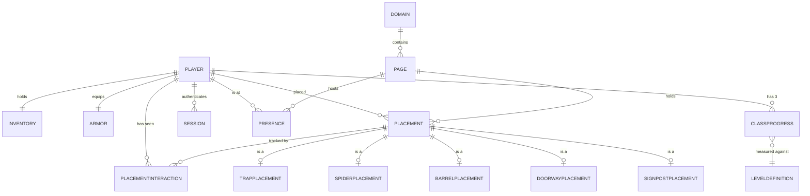
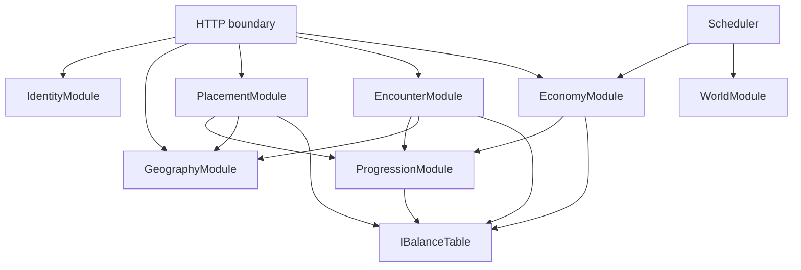
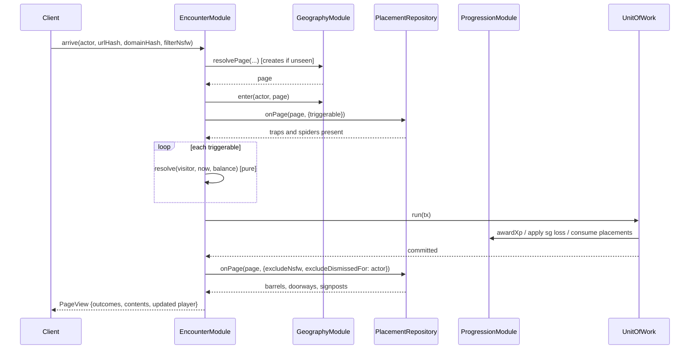
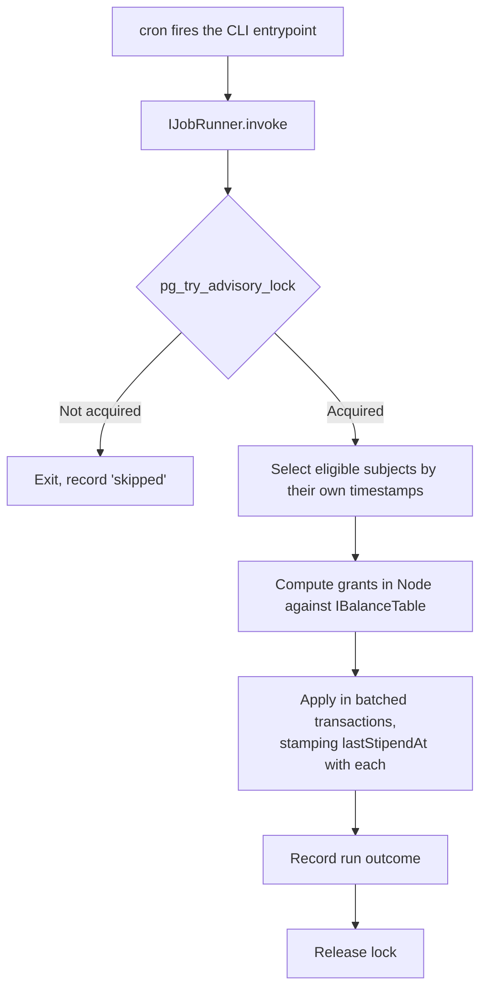

# TRD-01 — Nova Initia Server: Core Game Loop

**Status:** Draft, awaiting verification
**Derived from:** [BRD-01](BRD-01-core-game-loop.md), approved 2026-08-06, Amendments A–D
**Stack:** Node + PostgreSQL (D14)
**Evidence:** [PHP-ERA-FINDINGS.md](PHP-ERA-FINDINGS.md), [PARITY-REVIEW.md](PARITY-REVIEW.md)

Every element below traces to a workflow or decision in BRD-01. Where this document makes a
judgement the BRD does not dictate, it says so and marks it **[TRD judgement]**.

---

## 1. What this document is for

A planner should be able to read this and understand what the system is. An implementer should
be able to read it and know what to build. It stops deliberately short of implementation: no
SQL DDL (that is database-schema-design), no function bodies (that is stubbing-out-project).

**TypeScript, confirmed by the Project Owner 2026-08-06.** D14 says Node, and TypeScript is
Node. The domain below leans on contracts that objects opt into; those are checkable at build
time in TypeScript and only by convention in JavaScript. The signatures in this document are
therefore normative, not merely illustrative.

---

## 2. Pass 1 — The nouns

### 2.1 The keystone: ToolType

Almost every rule in the game keys off tool type. This is a fixed table of six, not an entity
players create.

| id | Name | Class | Karma on use | Placed on a page? | Consumed when triggered? | XP on use |
|---:|---|---|---:|---|---|---|
| 0 | Trap | giver | **−1** | yes | yes | 5 |
| 1 | Barrel | giver | **+1** | yes | no — looted | 5 |
| 2 | Spider | guardian | **−1** | yes | yes | 5 |
| 3 | **Shield** | guardian | **+1** | **no — carried** | n/a | none |
| 4 | Doorway | guide | **−1** | yes | no — traversed | 10 |
| 5 | Signpost | guide | **+1** | yes | no — followed | 10 |

**Shield is the exception that shapes the model.** It is the only tool that is never placed on
a page — it is equipped and carried. Any abstraction that assumes "tool ⇒ placement" is wrong,
which is why §3 separates *tool* from *placement*.

The karma column is BRD-01 D10; the class column drives pricing (WF-4) and the stipend
(WF-16); the consumed column separates the two placement families in §3.

### 2.2 Player and its parts

**Player** — the only actor. Moderator and Operator are *roles on a Player*, not separate
types; BRD-01 §4 describes them as people, and v1 carried a moderator flag on the user record.

| Attribute | Notes |
|---|---|
| `id`, `name` | Identity |
| `credential` | Never stored recoverably (WF-2) |
| `activeClass` | giver / guardian / guide. Drives pricing, stipend, gates (D11) |
| `karma` | Integer `[0,100]`. Moves ±1 on own-class tool use (D10) |
| `sg` | Currency. Never negative |
| `inventory` | Count per ToolType — see below |
| `armor` | Shield state — see below |
| `progress` | Per-class level and experience — see below |
| `roles` | moderator, operator |
| `lastActiveAt` | Gates stipend eligibility (WF-16) |

**Inventory** — a count per ToolType, owned by exactly one Player. Modelled as a value held by
Player rather than a free-standing entity: BRD-01 has no workflow where an inventory exists
without its player.

- Invariant: no count is ever negative.
- Cap (Amendment A.4): per tool type, `max(level across all three classes) × 250`.

**Armor** — shield state: `isActive`, `chargesRemaining`. Distinct from the shield *inventory*
count. WF-8 moves a shield from inventory into armor and grants charges — 3 for a guardian,
1 otherwise.

**ClassProgress** — one per class per player: `level`, `experience`. Three per player, always.
XP accrues **per class by action type**, independently of `activeClass` — a guardian who trips a
trap still gains giver XP, so all three records fill up.

Only the **active** class can be levelled up (WF-15) and only its levels open ability gates
(D11). The other two pools accumulate and sit inert. That is v1's behaviour and, under **D21**
which withdrew class switching, it is now deliberate rather than provisional: the banked pools
are what would make switching meaningful if it is ever revisited.

### 2.3 Geography

**Domain** — a website. `id`, `domainHash`, `uri`, `hitCount`.

**Page** — the unit of game geography. `id`, `urlHash`, `domainHash`, `domain`,
`normalisationVersion`.

Amendment D.2 makes page identity **first-class**: everything references the page's identity,
never the hash pair. Two reasons — wandering spiders need "another page in this domain"
(OPEN-5), and a stable identity is what placements and presence hang off.

`normalisationVersion` comes from **Amendment F / D18**. The rule deciding *which URLs are the
same place* is versioned, because changing it moves every page identity in the game. Storing
the version with the page turns a future correction into a migration instead of a silent board
reset. `GeographyModule.resolvePage` must **reject an unknown or retired version** rather than
accept it — hashes computed under a different rule address a different board.

Per **F.4**, normalisation *executes on the client* (D6 keeps raw URLs from the server) while
the server owns the *specification*. The server therefore cannot verify normalisation was
performed correctly — that is **RISK-1**, already accepted and inherited here rather than newly
introduced.

**Presence** — a Player is on a Page, since a time. Created by WF-3, removed by WF-14, and
**must expire on its own** because a client may vanish without reporting (OPEN-11).

### 2.4 Placement — the spine

**Placement** is the record that a tool was put on a page. One per placed tool instance.

| Attribute | Notes |
|---|---|
| `id` | |
| `toolType` | One of the five placeable types — never Shield |
| `placer` | The Player |
| `page` | |
| `placedAt` | **Age drives damage (WF-6) and XP (WF-7, WF-10)** — never derive age from anything else |
| `placerClass`, `placerLevel` | **Snapshotted at placement.** Later behaviour reads these, not the player's current state — a trap set by a level-11 giver keeps behaving like one after they level |

Five detail types extend it, each adding only what its own workflows need:

- **TrapPlacement** — `isAnonymous` (D5; giver level 10+)
- **SpiderPlacement** — `variant`: standard, wandering (guardian 15+), anti-signpost (guardian 10+)
- **BarrelPlacement** — `contents` (sg + per-type counts), `insideMessage`, `outsideMessage`, `durability`, `visitCount`
- **DoorwayPlacement** — `destinationUrl`, `chargesRemaining`, `isNsfw`, `chain` reference
- **SignpostPlacement** — `destinationUrl`, `title`, `comment`, `isNsfw`, up to four branch references

The snapshotting of placer class and level is the subtlest requirement in this document and is
easy to lose: WF-6's damage table and WF-11's charge count both read the *placer's state at the
time of placement*.

### 2.5 PlacementInteraction — one record, three jobs

Per `(Player, Placement)`. Amendment D.1 identified that v1 uses one record for three purposes,
and collapsing it later would be painful:

| Field | Serves |
|---|---|
| `useCount` | WF-11 pass-through limits — 1 for any player, 3 for the doorway's own placer |
| `isDismissed` | WF-18 — suppress from this player's view |
| `hasRated` | BRD-06 rating eligibility — **not used in this BRD**, see §7.3 |
| `firstSeenAt`, `lastUsedAt` | Ordering and audit |

WF-3 and WF-11 must create this record on first encounter whether or not the player ever
dismisses or rates anything.

### 2.6 Progression and the economy

**LevelDefinition** — reference data, 25 rows, shared by all three classes (Amendment A.1):
`level`, `name`, `experienceThreshold`, `sgCost`, `stipendSg`, `toolAllowance`.

`experienceThreshold` is the XP needed to advance **from** that level.

**StipendRun** — a record that a stipend cycle executed, with its timestamp. v1 keeps this, and
it exists for exactly one reason: **a double-run pays every player twice.** It is the
idempotency key for WF-16.

**Session** — `token`, `player`, `expiresAt`. WF-2 requires unguessable and expiring; the token
must come from a cryptographic source, not `Math.random`.

### 2.7 Relationships



---

## 3. Pass 2 — Abstractions

Three, each justified by cases present in BRD-01. Nothing here is speculative.

**1. `Placement` as a base.** Five concrete types; WF-5 describes one placement workflow
covering all of them, with identical inventory, gate, and karma handling. Earned.

**2. `Player` as the single actor type.** BRD-01 names Player, Moderator, Operator. The latter
two differ only in rights, and both are people who also play. Roles on Player, not subtypes.

**3. Two placement *families*, expressed as interfaces rather than a class hierarchy** (§4):

| Family | Members | Behaviour |
|---|---|---|
| Triggered | Trap, Spider | Fire on arrival, consumed, deal sg loss, pay the placer |
| Persistent | Barrel, Doorway, Signpost | Survive encounter, offer an action, limited per player |

**Deliberately not abstracted:**

- *No `Tool` hierarchy.* ToolType is reference data, not a class tree. Shield alone would break it.
- *No rating abstraction.* Rating is BRD-06, unapproved. The seam is §7.3.
- *No `Group`/tour type.* BRD-05, unapproved. §7.3.
- *No generic "game object".* Nothing in BRD-01 needs Player and Placement to share a supertype.

---

## 4. Pass 3 — Cross-cutting interfaces

```typescript
/** Anything put on a page. Five implementors. */
interface IPlaced {
  readonly id: PlacementId;
  readonly toolType: ToolType;
  readonly placerId: PlayerId;
  readonly pageId: PageId;
  readonly placedAt: Date;
  /** Snapshotted at placement — see §2.4. */
  readonly placerClass: PlayerClass;
  readonly placerLevel: number;
}

/** Resolves on arrival and is consumed. Trap, Spider. */
interface ITriggerable extends IPlaced {
  /** Pure: computes the outcome, applies nothing. */
  resolve(visitor: Player, now: Date, balance: IBalanceTable): TriggerOutcome;
}

/** Survives encounter; per-player interaction is tracked. Barrel, Doorway, Signpost. */
interface IInteractable extends IPlaced {
  /** Per-player ceiling on uses. Doorway: 1, or 3 for its own placer. */
  useLimitFor(player: Player): number;
}

/** Can be hidden from one player's view without affecting others. WF-18. */
interface IDismissable extends IInteractable {}

/** Carries a player-supplied destination that a client will navigate to. */
interface IHasDestination extends IPlaced {
  readonly destinationUrl: string;
  readonly isNsfw: boolean;
}
```

`IHasDestination` exists to give BRD-03 Moderation and the D.3 NSFW filter a single contract to
bind against, rather than naming Doorway and Signpost separately in every query. It is
justified by BRD-01 D.3, which already filters both.

`TriggerOutcome` is a **value**, not a mutation — `resolve` computes what should happen and the
caller applies it transactionally. This is what makes WF-6 and WF-7 testable against the
`config.js` tables without a database. **[TRD judgement]**

```typescript
type TriggerOutcome = {
  fired: boolean;              // false when the 5% trap failure roll wins
  sgLoss: number;              // damage, denominated in sg (Amendment A.2)
  absorbedByShield: boolean;
  placerXp: { playerClass: PlayerClass; amount: number } | null;
  visitorXp: { playerClass: PlayerClass; amount: number } | null;
  consumesPlacement: boolean;
};
```

---

## 5. Pass 4 — Generic component interfaces

```typescript
interface IRepository<T> {
  byId(id: string): Promise<T | null>;
  save(entity: T, tx?: Transaction): Promise<void>;
}

interface IPlacementRepository<T extends IPlaced> extends IRepository<T> {
  onPage(pageId: PageId, filter: PlacementFilter): Promise<T[]>;
  remove(id: PlacementId, tx: Transaction): Promise<void>;
}

/** Applied by the repository layer, not by callers — see §8.3. */
type PlacementFilter = {
  excludeNsfw: boolean;                 // D.3, per request
  excludeDismissedFor?: PlayerId;       // D.1
};

/** All of config.js, read-only, resolved at build time (D2). */
interface IBalanceTable {
  costOf(tool: ToolType, forClass: PlayerClass): number;
  levelGateFor(ability: GatedAbility): { playerClass: PlayerClass; level: number };
  trapDamageFor(ageMs: number): number;
  spiderXpFor(ageMs: number): number;
  barrelXpFor(ageMs: number): number;
  levelDefinition(level: number): LevelDefinition;
  karmaDeltaFor(tool: ToolType): -1 | 1;
  branchAllowance(playerClass: PlayerClass, level: number): number;
}

/** The one place a multi-step change becomes atomic. §8.2. */
interface IUnitOfWork {
  run<T>(fn: (tx: Transaction) => Promise<T>): Promise<T>;
}
```

`IBalanceTable` is the whole of `config.js` behind one contract, and every rule in the game is
testable through it without a database.

**Its methods stay synchronous even though D23 moved the values into the database.** The
implementation loads the balance set into memory at startup and exposes an explicit reload; it
never queries per call. Three reasons this matters:

1. `trapDamageFor` and its siblings are called inside trigger resolution, which TRD §4 requires
   to be a **pure** computation returning a `TriggerOutcome` value. An async lookup there would
   make the outcome depend on I/O ordering.
2. A test can construct an `IBalanceTable` from literals and exercise every recovered rule with
   no database at all — which is what makes parcel 2 the highest-value unit-testing target.
3. Balance changes are rare and operator-initiated. Paying a query per rule evaluation to
   support an hourly-at-most edit is the wrong trade.

```typescript
interface IBalanceProvider {
  load(): Promise<IBalanceTable>;
  reload(): Promise<IBalanceTable>;
}
```

The provider is async and reads the tables; the table it returns is synchronous and immutable.
A reload swaps the whole set atomically rather than mutating in place, so no request can observe
a half-updated ruleset.

---

## 6. Pass 5 — Top-level modules



| Module | Workflows | Responsibility |
|---|---|---|
| **IdentityModule** | WF-1, WF-2, WF-17 | Registration, authentication, sessions, class change |
| **GeographyModule** | WF-3 (identity half), WF-14 | Page/domain registry, presence, expiry |
| **PlacementModule** | WF-5, WF-9, WF-18 | Placing tools, stashing barrels, dismissal |
| **EncounterModule** | WF-3 (resolution half), WF-6, WF-7, WF-8, WF-10, WF-11, WF-12 | Everything that happens when a player meets a placement |
| **EconomyModule** | WF-4, WF-15, WF-16 | Shop, level purchase, stipend |
| **ProgressionModule** | WF-13, karma | XP and karma. **No player-facing entry point** |
| **WorldModule** | OPEN-5 | Scheduled world changes — wandering spiders |

**ProgressionModule is the security keystone.** BRD-01 WF-13 forbids a callable XP grant. It is
therefore internal-only, reachable from other modules and never from the HTTP boundary.

---

## 7. Method contracts

All I/O is `Promise`-returning; pure rule evaluation is synchronous.

### 7.1 The modules

```typescript
class IdentityModule {
  /** Class is chosen here and never changes — D21 withdrew WF-17. */
  register(name: string, credential: string, email: string,
           chosenClass: PlayerClass): Promise<{ player: Player; session: Session }>;
  authenticate(name: string, credential: string): Promise<Session>;   // generic failure
  resolveSession(token: string): Promise<Player | null>;
}

class GeographyModule {
  resolvePage(urlHash: string, domainHash: string): Promise<Page>;    // creates on first sight
  enter(actor: Player, page: Page): Promise<void>;
  leave(actor: Player, page: Page): Promise<void>;
  expireStalePresence(olderThan: Date): Promise<number>;              // OPEN-11
  pagesInDomain(domainId: DomainId, excluding: PageId): Promise<Page[]>;
}

class PlacementModule {
  /** Rejects on: insufficient inventory, locked ability, page tool limit, or the D16 cap. */
  place(actor: Player, page: Page, spec: PlacementSpec): Promise<Placement>;
  stashBarrel(actor: Player, page: Page, spec: BarrelSpec): Promise<BarrelPlacement>;
  dismiss(actor: Player, placement: Placement): Promise<void>;        // WF-18
  /** D16: at most 250 of a tool type per page per player. */
  countOnPageBy(page: PageId, player: PlayerId, tool: ToolType): Promise<number>;
}

class EncounterModule {
  /** WF-3. Resolves triggers, then reports what survives filtering. */
  arrive(actor: Player, page: Page, opts: { filterNsfw: boolean }): Promise<PageView>;
  toggleShield(actor: Player): Promise<Armor>;                        // WF-8
  lootBarrel(actor: Player, barrel: BarrelPlacement): Promise<LootResult>;
  traverseDoorway(actor: Player, doorway: DoorwayPlacement): Promise<TraversalResult>;
  followSignpost(actor: Player, signpost: SignpostPlacement): Promise<SignpostResult>;
}

class EconomyModule {
  purchase(actor: Player, tool: ToolType, quantity: number): Promise<Inventory>;
  levelUp(actor: Player): Promise<ClassProgress>;                     // WF-15
  runStipend(now: Date): Promise<StipendRunSummary>;                  // WF-16, scheduled
}

/** Internal only. Never bound to a route. */
class ProgressionModule {
  awardXp(tx: Transaction, player: Player, cls: PlayerClass, amount: number): Promise<void>;
  adjustKarma(tx: Transaction, player: Player, tool: ToolType): Promise<void>;
  canAdvance(player: Player, cls: PlayerClass): boolean;              // pure
}

class WorldModule {
  moveWanderingSpiders(now: Date): Promise<number>;                   // OPEN-5, scheduled
}
```

### 7.2 Call flow — arriving at a page (WF-3)

The most-executed path in the system.



Two ordering rules, both from BRD-01 WF-3: **triggers resolve before contents are reported**,
and **filtering happens before reporting** so two players on one page may see different things.

### 7.3 Seams left open for unapproved BRDs

Named so the model does not have to be reshaped later:

| Seam | Attaches to | Awaiting |
|---|---|---|
| `PlacementInteraction.hasRated` | Already present, unused here | BRD-06 |
| Tour / chain container | `SignpostPlacement` branches, `DoorwayPlacement.chain` | BRD-05 |
| `IHasDestination` | Doorway, Signpost | BRD-03 — a withheld state to filter on |
| Notification on trigger | `TriggerOutcome` | BRD-02 — v1 mails the placer |
| **Tool parts** | A single consumption event — see below | A future BRD |

**Tool parts** is a deferred feature, described in [PHP-ERA-FINDINGS §6b](PHP-ERA-FINDINGS.md):
a consumed tool leaves parts behind, which can later be assembled into new things or traded.
Out of scope here, and its taxonomy does not yet exist.

One consequence is **actionable now, for BRD-01's own sake**. Tools are consumed in six places —
trap trigger, spider trigger, shield charge, barrel exhaustion, doorway charge depletion, and
failed placement — and six duplicated deletion paths is already a defect regardless of parts.
Route them all through **one consumption operation**:

```typescript
/** The single point at which a tool ceases to exist. */
interface IConsumption {
  consumePlacement(tx: Transaction, placement: IPlaced, cause: ConsumptionCause): Promise<void>;
  consumeFromInventory(tx: Transaction, player: Player, tool: ToolType, qty: number): Promise<void>;
}

type ConsumptionCause = 'triggered' | 'exhausted' | 'depleted' | 'looted' | 'placement-failed';
```

Parts then attaches at one seam instead of six. Two further notes, recorded so they are not
discovered late: **inventory should be a keyed collection rather than six fixed columns**, and
**nothing should hard-code the number six** — assembled tools imply the type set grows.

None of these is built here. Each is a place where BRD-01's model already has the attachment
point, so adding them is additive rather than structural.

---

## 8. Security

BRD-01 §4 stated rights in actor names. Restated in the domain's nouns:

| BRD-01 right | In domain terms |
|---|---|
| Spend only your own inventory | Every `Inventory` mutation takes the acting `Player` and asserts `inventory.ownerId === actor.id` |
| Never spend another's | No module method accepts both an actor and a separate target inventory |
| Never self-grant XP/sg/items | `ProgressionModule` is unreachable from the HTTP boundary |
| Cannot see another's inventory, mail, key | The Player projection returned by any read path other than "self" omits them |
| Cannot see an anonymous trap's placer | `TriggerOutcome` omits `placerId` when `isAnonymous` |

### 8.1 How rights are enforced

Every module method takes the **acting Player** as its first parameter, resolved from a session
by the HTTP boundary — never an id supplied by the caller. A method that does not take an actor
cannot be reached from a route.

### 8.2 Atomicity is a security property, not a performance one

BRD-01 WF-5 requires that inventory decrement and placement creation happen together. v1
decremented first and could lose the tool on a later failure. Every one of these must run
inside a single `IUnitOfWork.run`:

| Operation | Must be atomic across |
|---|---|
| WF-5 place | inventory − 1, placement insert, initial XP, karma |
| WF-4 purchase | sg −, inventory + |
| WF-9 stash | barrel insert, **and every item placed inside it** |
| WF-6/7 trigger | sg loss, placer XP, shield charge, placement delete |
| WF-10 loot | contents → inventory, placer XP, visit count |
| WF-11 traverse | charge −, interaction record, placer XP |
| WF-15 level up | **threshold and sg check, sg −, level +** |
| WF-16 stipend | grants and the run record together |

**WF-15 and WF-16 are the two that bite.** WF-15's precondition check and its mutation must be
in one transaction or two concurrent calls both pass the check — v1's endpoint validated
nothing at all, and BRD-01 requires the server to. WF-16 without its run record written in the
same transaction can pay every player twice.

### 8.3 Filtering belongs to the repository

NSFW exclusion (D.3) and dismissal exclusion (D.1) are applied by `IPlacementRepository`, not
by callers. A caller that forgets a filter is a leak; a repository that requires an explicit
`PlacementFilter` makes forgetting visible at the call site. **[TRD judgement]**

### 8.4 Inherited, unmitigated

**RISK-1 stands.** The server cannot verify that a client is on the page it claims. Nothing in
this design fixes that, and nothing pretends to. Two consequences the implementation should
respect: never treat a client-supplied page hash as evidence of anything but intent, and keep
every grant traceable to the placement and player that caused it, so that abuse is at least
detectable after the fact.

**RISK-2 stands.** Page identity derives from a reversible URL hash, accepted by D6.

**How the hash reaches the server is a transport choice, and the domain model is indifferent
to it.** `GeographyModule.resolvePage(urlHash, domainHash)` does not care whether those values
arrived in a path, a body, or a header.

v1 carried them in the **hostname** — `<urlhash>.nova-initia.com`, served by a wildcard zone in
the game's own PowerDNS. See [PHP-ERA-FINDINGS §6c](PHP-ERA-FINDINGS.md). That transport
**should not be reproduced**: a DNS query is emitted before any connection and is typically
unencrypted, so it publishes each page hash — and thus, given D6's reversibility, the player's
browsing history — to their resolver, their ISP, and any observer on the path. That is a wider
exposure than RISK-2, which concerns only what *the server* can reconstruct, and D6 does not
cover it.

**Recommendation: carry both hashes in the request path or body over HTTPS.** The value reaches
`resolvePage` identically, page identity stays inside the encrypted channel, and the project
does not need to operate DNS. This is a **[TRD judgement]** open to reversal, but it should be
reversed deliberately rather than inherited.

---

## 9. External dependencies

| Dependency | Purpose |
|---|---|
| PostgreSQL | Sole datastore (D14) |
| Node crypto | Session tokens and credential hashing — **not `Math.random`** (WF-2) |
| A scheduler | WF-16 stipend, WF-14 presence expiry, OPEN-5 spider movement |
| HTTP framework | The API boundary |

No third-party service. OpenID appeared in v2 but is unreferenced and not carried forward.

**Resolved 2026-08-06.** The Project Owner confirms v1's stipend was driven by a **cron job**.
That separates the two halves of the question cleanly, and both go the same way in v3:

- **Scheduling is external.** A cron or scheduler invokes the work; the server does not run its
  own internal timer loop. Faithful to v1.
- **The logic lives in Node**, not a PostgreSQL function. v1 put it in a stored procedure only
  because cron had to call *something*; the scheduling was external either way. Under D14 with
  TypeScript, a Node module is testable against `IBalanceTable` with no database in the loop.

`EconomyModule.runStipend(now)` and `WorldModule.moveWanderingSpiders(now)` are therefore
**entry points invoked by an external scheduler**, not routes and not internal timers.

Two consequences the implementation must respect:

1. **They must be idempotent per cycle.** An external scheduler can double-fire, retry, or
   overlap with a slow previous run. `StipendRun` is the guard, and it must be written in the
   same transaction as the grants — see §8.2.
2. **They must not be reachable from the HTTP boundary.** A callable stipend is a money
   printer. Same rule as `ProgressionModule`.

---

## 10. Scheduled work

Three jobs exist, and more will follow, so this is a system rather than three cron lines.

| Job | Cadence | Touches | Damage if it runs twice |
|---|---|---|---|
| **Stipend** (WF-16) | hourly | Every recently-active player's sg and inventory | **Severe — pays everyone twice** |
| **Spider movement** (OPEN-5) | periodic | Wandering spider placements | Mild — spiders move twice |
| **Presence expiry** (WF-14, OPEN-11) | frequent | Stale presence rows | None — naturally idempotent |

### 10.1 The core principle: idempotency belongs to the subject, not the run

v1 guarded the stipend with a global run log and selected players by `LastLogin` within the
past hour. That has two failure modes, and v1 had both:

- **A late run shifts the window.** Fire at 61 minutes and everyone active in minute 0 is
  silently skipped. Fire at 59 and some are paid twice.
- **A double-fire pays twice**, because nothing on the *player* records that they were paid.

The fix is to move the guard onto the rows the job touches. Each subject carries the timestamp
of when the job last affected it, and eligibility is expressed against that:

```
eligible(player) ⟺ player.lastActiveAt  >= now − activityWindow
                 ∧ player.lastStipendAt <= now − stipendInterval
```

**`lastActiveAt` is set when the player uses a tool — WF-5 placement, WF-9 stashing, WF-8
equipping a shield — and by nothing else.** Not by page entry.

This follows the in-game manual, which states the rule directly: *"Every hour that a tool is
used will be an hour that a stipend will be awarded for."* v1's implementation was looser than
its own design — the signal was an `ON UPDATE CURRENT_TIMESTAMP` column that refreshed on *any*
write to the player row, so being trapped by someone else also counted. That was a storage-layer
side effect, not a decision.

Following the documented rule also makes the economy self-consistent: the stipend exists to
encourage tool use, so paying it for passive browsing rewards the opposite. And it puts
`lastActiveAt` on the same trigger as karma, which under **D10** also moves only on tool use —
one action, both consequences. See [PHP-ERA-FINDINGS §4b](PHP-ERA-FINDINGS.md) and
[LORE folio 13](../LORE/13-gaining-sg-in-nova-initia.md).

Grant, then set `lastStipendAt = now` **in the same transaction**. Now:

- Running twice in a row is a no-op — the second pass finds nobody eligible.
- A late run still pays everyone, just later. No one is skipped.
- A missed run does not double-pay afterwards, and does not accumulate a backlog.
- Correctness no longer depends on the scheduler firing accurately, which is the only property
  worth having, because schedulers do not fire accurately.

The same pattern applies to spider movement via `lastMovedAt` on the placement, which also
stops a spider being moved twice in one cycle. Presence expiry needs nothing — deleting an
already-deleted row is a no-op.

**The run ledger survives, but demoted.** `StipendRun` becomes observability — what ran, when,
how long, how many rows — and stops being the correctness mechanism. Correctness that depends
on a single global row is correctness with one point of failure.

### 10.2 The job contract

```typescript
type JobName = 'stipend' | 'spider-movement' | 'presence-expiry';

interface ScheduledJob {
  readonly name: JobName;
  /** Advisory only. Correctness must never depend on this being honoured. */
  readonly interval: Duration;
  /** Must be safe to invoke twice in succession with no additional effect. */
  run(now: Date, tx: Transaction): Promise<JobResult>;
}

type JobResult = { considered: number; affected: number; note?: string };

interface IJobRunner {
  /** Takes the lock, runs, records the outcome, releases. Errors are contained. */
  invoke(name: JobName, now: Date): Promise<JobRunRecord>;
}
```

`run` receives `now` rather than calling the clock, so every job is testable at any point on the
timeline without waiting or mocking globals. This matters most for the age-bracket rules.

### 10.3 Mutual exclusion — use PostgreSQL advisory locks

If the server ever runs as more than one instance, two schedulers fire the same job at the same
moment. Subject-level idempotency already prevents double payment, but concurrent runs still
waste work and interleave confusingly.

`pg_try_advisory_lock(hashtext('job:' || name))` costs nothing, needs no extra service, and is
released automatically when the connection drops — so a crashed worker cannot wedge a job
permanently, which is the usual failure of a lock table. If the lock is not acquired, the job
exits immediately and records that it was skipped.

### 10.4 The trigger — start with cron, keep it swappable

**Recommendation: an OS cron or systemd timer invoking a CLI entrypoint**, one per job.

This is what v1 did, it needs no dependency, and the scale does not justify more: three jobs,
hourly at most, over a few thousand players.

The important part is that the **trigger is swappable and the job contract is not**. Everything
above — the contract, subject-level idempotency, advisory locking — is independent of what
calls `IJobRunner.invoke`. If you later want retries, backoff, job history, or ad-hoc
enqueueing, move to a PostgreSQL-backed runner such as `graphile-worker` or `pg-boss` and the
jobs themselves do not change. Both use the database you already have, so neither adds a
service.

**Avoid an in-process timer** (`setInterval`, `node-cron` inside the API process). It ties job
execution to API uptime, silently duplicates under multiple instances, and competes with
request handling on the same event loop. **Avoid `pg_cron`**, which would put the logic back in
SQL and split the balance table across two languages — the thing §9 just resolved.

### 10.5 How the stipend should actually execute

Fetch eligible players, compute grants **in Node against `IBalanceTable`**, apply in batched
transactions. Not a single bulk `UPDATE ... FROM`.

The stipend formula is karma-weighted with a floor, and the tool grant branches on class and
karma. Expressing that in SQL would move the balance rules out of `IBalanceTable` and into a
query, where they cannot be unit-tested against `config.js`. The cost of keeping them in Node
is one round trip per batch — at a few thousand players that is milliseconds, and per the
performance analysis this workload has no CPU in it.

If it ever became slow, the fix is batch size, not relocating the rules.



---

## 11. Verification

Two questions, per the process:

1. **Does this represent a reasonable implementation of BRD-01?**
2. **Is the detail level right — enough to build from, not so much that it forecloses judgement?**

Two of the three points raised at drafting are now **resolved by the Project Owner**:

- ~~**§1 — TypeScript over JavaScript.**~~ **Confirmed: TypeScript.**
- ~~**§9 — stipend in Node or in PostgreSQL.**~~ **Resolved:** v1 used cron, so scheduling stays
  external and the logic goes in Node. See §9.

- ~~**§2.4 — snapshotting placer class and level.**~~ **Confirmed:** a tool carries the power
  its placer had at the time it was laid. Promoted to **BRD-01 D17** so it is a requirement
  rather than a TRD judgement.

**TRD-01 is verified.** Two amendments arrived with that confirmation and are reflected above:

- **D15** — the doorway upper charge tier belongs to the **guide** at level 15+, not the giver.
  `config.js` says giver; the Project Owner has ruled that a transcription error.
- **D16** — a player may place at most **250 of a tool type on any one page**. Distinct from the
  inventory cap, which limits holdings rather than placements.
